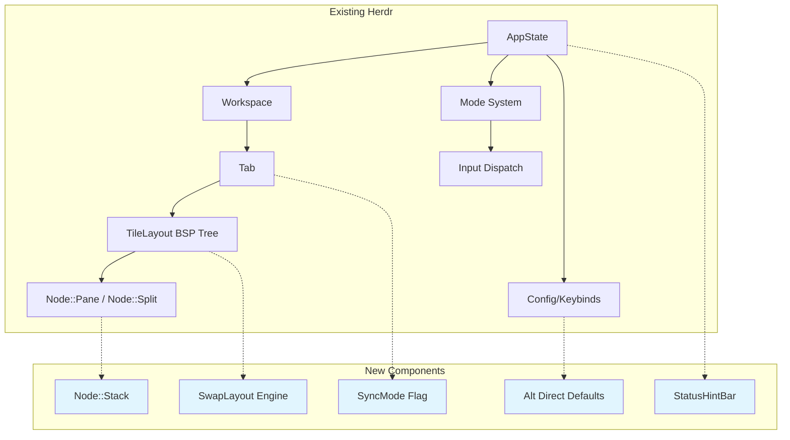

# Zellij Feature Parity for Herdr — Detailed Design

## Overview

This design identifies Zellij features worth porting to herdr, ranked by value-to-effort ratio and alignment with herdr's agent-orchestration identity. The goal is selective cherry-picking — not full Zellij parity — focusing on pane/tab management ergonomics and shortcut discoverability.

## Detailed Requirements

### Must-Have (P0)
1. **Alt shortcuts for common operations** — direct Alt+key bindings that work without prefix entry
2. **Contextual shortcut hints bar** — a 1-line bottom bar showing available shortcuts based on current mode

### Should-Have (P1)
3. **Stacked panes** — accordion-style layout where collapsed panes show only title, one expanded
4. **Swap/auto layouts** — predefined arrangements that adapt as pane count changes

### Nice-to-Have (P2)
5. **Sync mode** — send keystrokes to all panes in a tab simultaneously
6. **Expose pane-move keybinding** — keyboard shortcut for existing `herdr pane move --new-tab` API

*Note: Pinned floating panes removed from scope. Herdr does not currently have a floating pane system; building one from scratch is a separate, larger project.*

## Architecture Overview



## Components and Interfaces

### Feature 1: Alt Shortcuts (P0) — Effort: LOW

**Current state:** Herdr already supports `BindingTrigger::Direct(KeyCombo)` for non-prefix bindings. The keybinding parser handles `"alt+h"` syntax. Safety logic rejects unmodified printable chars but allows modified keys (Alt, Ctrl).

**What to do:** Add Alt default bindings alongside existing prefix bindings. No architectural change required.

**Proposed default Alt bindings:**

| Shortcut | Action | Existing Prefix Equivalent |
|----------|--------|---------------------------|
| `Alt+h` | Focus pane left | `prefix+h` |
| `Alt+j` | Focus pane down | `prefix+j` |
| `Alt+k` | Focus pane up | `prefix+k` |
| `Alt+l` | Focus pane right | `prefix+l` |
| `Alt+n` | New pane (split auto-direction) | `prefix+v` / `prefix+minus` |
| `Alt+x` | Close pane | `prefix+x` |
| `Alt+z` | Toggle zoom | `prefix+z` |
| `Alt+[` | Previous tab | `prefix+p` |
| `Alt+]` | Next tab | `prefix+n` |
| `Alt+{` | Previous swap layout | (new — Feature 4) |
| `Alt+}` | Next swap layout | (new — Feature 4) |
| `Alt+f` | Toggle floating pane layer | (new) |
| `Alt+=` | Resize increase | resize mode |
| `Alt+-` | Resize decrease | resize mode |

**Implementation:**
- In `KeysConfig` defaults (src/config/model.rs), change single bindings to `BindingConfig::Many` with both prefix and alt variants
- Example: `focus_pane_left: BindingConfig::Many(vec!["prefix+h".into(), "alt+h".into()])`
- User can override to disable alt bindings: `focus_pane_left = "prefix+h"` (single string removes alt)
- Need new action `split_auto` that picks vertical or horizontal based on current pane aspect ratio
- Algorithm: if focused pane `width > height * 1.5` → split Vertical (side-by-side); else → split Horizontal (stacked). Square panes default to Vertical.

**Risk:** Alt key conflicts with terminal applications (vim uses Alt, some shells use Alt for word movement). Mitigated by making these configurable — users can remove alt bindings. Known limitation: users running herdr inside tmux/screen may find Alt keys consumed by the outer multiplexer; they should use prefix bindings instead.

**Effort estimate:** ~50 lines of config changes + 1 new action (`split_auto`). 1-2 hours.

---

### Feature 2: Contextual Shortcut Hints Bar (P0) — Effort: MEDIUM

**Current state:** No persistent bottom bar. Herdr shows shortcut overlays only when in navigate/prefix/resize modes. The keybind help screen (`prefix+?`) shows all shortcuts but requires mode entry.

**What to do:** Add a 1-line bar at the bottom of the terminal area showing mode-relevant shortcuts. Configurable: on/off/compact.

**Proposed design:**

```
Terminal mode:   [Alt+h/j/k/l Navigate] [Alt+n Split] [Alt+z Zoom] [Ctrl+B Prefix]
Prefix mode:    [c Tab] [v Split↕] [- Split↔] [x Close] [z Zoom] [? Help] [r Resize]
Resize mode:    [h/j/k/l Resize] [= Equal] [Esc Exit]
Navigate mode:  [h/j/k/l Pane] [↑↓ Workspace] [Enter Select] [Esc Exit]
```

**Mode overlay interaction:** When the user enters Navigate, Prefix, or Resize mode, the existing mode overlays (rendered at bottom of terminal_area) replace the hint bar content. The hint bar row shows mode-specific shortcuts during those modes — it doesn't render as a separate additional row.

**Architecture:**

```rust
// New module: src/ui/hint_bar.rs
pub enum HintBarStyle {
    Full,     // show all relevant hints (default)
    Compact,  // show only top 4 hints
    Off,      // hidden — no row allocated
}

// In compute_view_internal, allocate 1 row at bottom when enabled:
// [sidebar | [tab_bar (1 row) / terminal_area / hint_bar (1 row)]]
```

**Data source:** The `Keybinds` struct already has action→keybind mapping. Each mode has a fixed set of relevant actions. The hint bar reads the resolved keybind labels for those actions.

**Implementation:**
- New `src/ui/hint_bar.rs` module
- Modify `compute_view_internal` to allocate bottom row: `Layout::vertical([Length(1), Min(1), Length(1)]).areas(main_area)` → `(tab_bar, terminal_area, hint_bar)`
- Render function takes `&AppState` (mode + keybinds) and draws contextual hints
- Add `HintBarStyle` to `UiConfig` in config model (TOML: `hint_bar = "full" | "compact" | "off"`)
- Add `hint_bar_rect` to `ViewState` for mouse hit testing (if needed later)

**Risk:** Costs 1 row of terminal space. Users who maximize terminal area will want to disable it. Configurable via `[ui] hint_bar = "off"`.

**Effort estimate:** ~200 lines (UI rendering + config + layout adjustment). 4-6 hours.

---

### Feature 3: Stacked Panes (P1) — Effort: HIGH

**Current state:** The BSP tree has only `Node::Pane` and `Node::Split`. There is no concept of multiple panes occupying the same space.

**What to do:** Add a `Node::Stack` variant where multiple panes share the same area, one expanded (full height), others collapsed to a single title row.

**Proposed layout model:**

```rust
pub enum Node {
    Pane(PaneId),
    Split {
        direction: Direction,
        ratio: f32,
        first: Box<Node>,
        second: Box<Node>,
    },
    Stack {
        panes: Vec<PaneId>,
        expanded: usize, // index of the expanded pane
    },
}
```

**Rendering:**

```
┌─ pane-1 (collapsed) ──────────────────────────┐
├─ pane-2 (expanded) ───────────────────────────┤
│                                                │
│  (full terminal content)                       │
│                                                │
├─ pane-3 (collapsed) ──────────────────────────┤
└─ pane-4 (collapsed) ──────────────────────────┘
```

Each collapsed pane takes exactly 1 row (title + status indicator). The expanded pane gets all remaining height.

**Navigation:**
- `Alt+k` / `Alt+j` within a stack moves the expanded index up/down
- Clicking a collapsed pane title expands it
- Existing `find_in_direction` needs to understand stacks (navigating "down" from above a stack enters the stack at the top, etc.)

**Key challenges:**
1. Every recursive function in `layout.rs` (`count_panes`, `collect_panes`, `collect_splits`, `split_at`, `remove_pane`, `set_ratio_at`) needs a `Node::Stack` arm — shotgun surgery across 8-12 match sites
2. `resolve_rects` (geometry computation) needs to allocate 1-row for collapsed + remainder for expanded
3. Pane resize within a stack doesn't make sense — stacks are fixed geometry
4. Serialization: `LayoutSnapshot` in `src/persist/snapshot.rs` needs new `Stack` variant + `capture_node()` update. Forward-compatible: old herdr encountering new snapshot format should skip/flatten stacks gracefully rather than crash
5. Focus tracking: focused pane should auto-expand
6. Collapsed panes still need PTY resize to 1-row height to prevent apps from losing state

**New operations:**
- `stack_focused()` — convert focused pane into a stack (or add to adjacent stack)
- `unstack_focused()` — remove focused pane from stack, place as sibling split
- `expand_in_stack(direction)` — navigate within stack

**Config:**
- `stack_pane = "prefix+s"` or `"alt+s"`
- `unstack_pane = "prefix+shift+s"`

**Effort estimate:** ~500-700 lines (layout engine changes + rendering + input + serialization + tests). 3-5 days (accounts for blast radius across all Node match sites and comprehensive testing).

**Note:** This feature warrants its own focused implementation design before coding begins, covering the interaction matrix (stack + resize, stack + zoom, stack + serialize, stack + find_in_direction).

---

### Feature 4: Swap/Auto Layouts (P1) — Effort: HIGH

**Current state:** Layout is purely manual — user splits and resizes. No predefined arrangements.

**What to do:** Define a set of layout templates that auto-apply based on pane count. Cycling through them with a keybind rearranges existing panes.

**Proposed model:**

```rust
// Declarative layout templates — serializable, configurable in TOML
pub enum LayoutTemplate {
    Columns,                      // all panes side by side
    Rows,                         // all panes vertically stacked
    MainLeft { main_ratio: f32 }, // one large pane left, rest stacked right
    MainTop { main_ratio: f32 },  // one large pane top, rest tiled below
    Grid,                         // roughly equal grid
}

pub struct SwapLayout {
    pub template: LayoutTemplate,
    pub min_panes: Option<usize>,
    pub max_panes: Option<usize>,
}
```

**Cycling:** `Alt+{` / `Alt+}` cycles through applicable layouts for current pane count. The layout engine rebuilds the BSP tree while preserving pane identities (same PaneIds, new tree shape).

**Auto-layout on pane add/remove:** When a pane is added or removed, if auto-layout is enabled, pick the best matching layout for the new count and rebuild.

**Key challenges:**
1. Rebuilding the tree while preserving PaneIds (reuse existing pane list, assign to new positions)
2. User expects their manual adjustments to "stick" — need to detect manual layout vs auto-layout mode
3. Performance: rebuilding tree triggers resize for all panes

**Config:**
```toml
[ui]
auto_layout = true  # auto-rearrange on pane add/remove
swap_layout_next = "alt+shift+]"  # Alt+}
swap_layout_prev = "alt+shift+["  # Alt+{
```

**Effort estimate:** ~400-600 lines (layout templates + cycling logic + auto-apply). 3-5 days.

**Note:** This feature warrants its own focused implementation design before coding begins, covering the declarative-vs-manual layout tension (one-shot switch: once user manually resizes, auto-layout is suppressed until next cycle command).

---

### Feature 5: Sync Mode (P2) — Effort: LOW

**Current state:** Input in terminal mode goes only to the focused pane's PTY.

**What to do:** Add a per-tab "sync" flag. When enabled, keystrokes written to the focused pane are also written to all other panes in the tab.

**Implementation:**
```rust
// In Tab:
pub sync_mode: bool,

// In input dispatch (terminal mode):
if tab.sync_mode {
    for pane_id in tab.panes.keys() {
        write_to_pty(pane_id, &input_bytes);
    }
} else {
    write_to_pty(focused_pane_id, &input_bytes);
}
```

**Visual indicator:** Show "SYNC" badge in tab bar when active.

**Config:** `sync_tab = "prefix+shift+s"` or similar.

**Effort estimate:** ~50 lines. 1-2 hours.

---

### Feature 6: Expose Pane-Move Keybinding (P2) — Effort: TRIVIAL

**Current state:** The full pane-move API already exists:
- `Workspace::create_tab_from_existing_pane()` (src/workspace.rs:961)
- `Tab::take_pane_for_move()` → `MovedPane` (src/workspace/tab.rs:458)
- `Workspace::insert_moved_pane_into_tab()` (src/workspace.rs:942)
- CLI: `herdr pane move <pane_id> --new-tab`
- API: `Method::PaneMove` with `PaneMoveDestination::{NewTab, Tab, NewWorkspace}`

**What to do:** Add a keyboard shortcut that triggers the existing `PaneMove { destination: NewTab }` action for the focused pane. No new workspace logic needed.

**Implementation:**
- Add `break_pane_to_tab` to `Keybinds` struct
- Wire it in input dispatch to call the existing pane move handler
- Default binding: `prefix+!` (shift+1, matches Zellij's `Ctrl+t` → `b`)

**Effort estimate:** ~20 lines (keybind config + dispatch wiring). 30 minutes.

---

### ~~Feature 7: Pinned Floating Panes~~ — REMOVED

Herdr does not currently have a floating pane system. The "floating panels" referenced in the codebase are UI modals/overlays (settings, dialogs), not terminal-multiplexer-style floating panes. Building a floating pane layer from scratch is a separate, larger project (estimated 1-2 weeks) that would be a prerequisite for pinned floating panes. Out of scope for this feature parity effort.

---

## Prioritized Implementation Order

| Phase | Feature | Effort | Value |
|-------|---------|--------|-------|
| 1 | Alt shortcuts | LOW (1-2h) | HIGH — immediate ergonomic win |
| 2 | Hint bar | MEDIUM (4-6h) | HIGH — discoverability for all users |
| 3 | Sync mode | LOW (1-2h) | MEDIUM — quick win while planning bigger features |
| 4 | Pane-move keybinding | TRIVIAL (30min) | MEDIUM — exposes existing API |
| 5 | Stacked panes | HIGH (3-5d) | HIGH — killer feature for agent workflows |
| 6 | Swap layouts | HIGH (3-5d) | HIGH — auto-organization for agent spawning |

Phases 1-4 can be implemented independently in any order. Phases 5-6 each need their own focused implementation design before coding.

## Data Models

### Config Extensions (src/config/model.rs)

```rust
// New fields in UiConfig:
pub hint_bar: HintBarStyle,  // "full" | "compact" | "off", default: "full"

// New fields in KeysConfig:
pub split_auto: BindingConfig,        // "alt+n"
pub swap_layout_next: BindingConfig,  // "alt+shift+]" (Alt+})
pub swap_layout_prev: BindingConfig,  // "alt+shift+[" (Alt+{)
pub stack_pane: BindingConfig,        // "prefix+s"
pub unstack_pane: BindingConfig,      // "prefix+shift+s"
pub sync_tab: BindingConfig,          // "prefix+shift+y"
pub break_pane_to_tab: BindingConfig, // "prefix+!"
```

### Layout Extension (src/layout.rs)

```rust
pub enum Node {
    Pane(PaneId),
    Split { direction: Direction, ratio: f32, first: Box<Node>, second: Box<Node> },
    Stack { panes: Vec<PaneId>, expanded: usize },
}
```

### State Extensions

```rust
// In Tab:
pub sync_mode: bool,

// In AppState (or ViewState):
pub hint_bar_rect: Rect,

// Config (UiConfig):
pub hint_bar: HintBarStyle, // "full" | "compact" | "off", default: "full"
```

## Persistence / State Migration

Adding `Node::Stack` to the layout engine requires a corresponding `LayoutSnapshot::Stack` variant in `src/persist/snapshot.rs`. Migration strategy:
- **Upgrading:** Old snapshots (no stacks) deserialize fine — they only have Pane/Split variants.
- **Downgrading:** An older herdr binary encountering a `Stack` variant in a snapshot should gracefully degrade (flatten the stack to the expanded pane only, losing collapsed panes from restore). This requires the serialization format to include a `snapshot_version` field, with version N+1 indicating stack support. Older versions skip unknown variants with a warning.

## Error Handling

- **Alt key conflicts:** If a terminal app inside a pane also uses Alt+h (e.g., Vim), the user's keystrokes will be intercepted. Mitigation: users can remove alt bindings from config, or use a "passthrough" toggle (similar to Zellij's Locked mode).
- **Stack with 0 panes:** Should never happen — removing the last pane from a stack removes the Stack node entirely and promotes to parent.
- **Swap layout with 1 pane:** No-op — single-pane tabs don't benefit from layout cycling.
- **Sync mode with read-only panes:** Sync writes to all panes; if a pane's PTY rejects input, that's fine (no error propagation needed).

## Testing Strategy

- **Alt shortcuts:** Unit test that default config produces both prefix and alt bindings for navigation actions. Integration test that `matches_direct_key` fires for Alt+h.
- **Hint bar:** Unit test that `hint_bar_hints(mode, keybinds)` returns correct set of hints per mode. Snapshot test for rendered hint bar content.
- **Stacked panes:** Unit tests for `Node::Stack` geometry computation (collapsed rows + expanded area). Tests for navigation into/out of stacks. Serialization roundtrip tests.
- **Swap layouts:** Unit tests that each built-in layout produces valid BSP trees for pane counts 1-8. Test that cycling preserves PaneIds.
- **Sync mode:** Test that toggling sync_mode causes writes to fan out to multiple PTYs.
- **Break pane to tab:** Test that moving a pane maintains the PaneId and PaneRuntime is undisturbed.

## Appendices

### Comparison Table: Zellij vs Herdr Feature Parity

| Feature | Zellij | Herdr (Current) | Herdr (Proposed) |
|---------|--------|-----------------|------------------|
| Tiled panes | Yes (BSP) | Yes (BSP) | Same |
| Floating panes | Yes | No | Out of scope (large project) |
| Stacked panes | Yes | No | Proposed (P1) |
| Tabs | Yes | Yes | + Pane-move keybind, sync |
| Workspaces/Sessions | Sessions | Full workspaces | Already superior |
| Alt shortcuts | Default | Supported but not default | Proposed defaults (P0) |
| Status/hint bar | Yes (WASM plugin) | No | Proposed (P0) |
| Resize mode | Yes | Yes | Same |
| Navigate mode | Yes | Yes | Same |
| Zoom/fullscreen | Yes | Yes | Same |
| Swap layouts | Yes | No | Proposed (P1) |
| Sync mode | Yes | No | Proposed (P2) |
| Pane move (break to tab) | Yes | Yes (API only) | + Keybinding (P2) |
| Plugin system | WASM | No | Out of scope |
| Layout files (KDL) | Yes | No (TOML config) | Out of scope |

### What NOT to Port

- **WASM plugin system** — herdr's value is in being a focused, fast tool; a plugin system adds complexity without clear benefit for the agent-workflow use case
- **KDL layout files** — TOML config + built-in swap layouts covers the need without a new DSL
- **Locked mode** — herdr's prefix model already prevents key conflicts; a separate locked mode adds UX complexity. Users with Alt conflicts should remove alt bindings from config.
- **Multiple status bar rows** — herdr's sidebar already handles workspace/agent info; a single hint line is sufficient
- **Floating panes** — herdr has no floating pane layer. Building one (overlay rendering, z-order, mouse drag, focus management, serialization) is estimated at 1-2 weeks. Separate project, not part of this parity effort.

## Acknowledged Tradeoffs

1. **Security model deferred:** Sync mode amplification (keystrokes sent to elevated sessions) and pane title sanitization (malicious OSC sequences in collapsed stack titles) are real concerns. They will be addressed during implementation design of each feature, not at this research/scoping level.
2. **P1 features need sub-designs:** Stacked panes and swap layouts are complex enough (3-5 days each, deep layout engine coupling) that they should not be implemented directly from this design. Each needs its own focused implementation design covering interaction matrices.
3. **Performance budget deferred:** The composed-system performance cost (all features active, high pane counts) should be profiled during P1 implementation, not pre-designed at this scoping level.
4. **Alt keys in nested multiplexers:** Users running herdr inside tmux/screen may have Alt keys consumed by the outer multiplexer. This is a known limitation, not a blocker — those users should rely on prefix bindings instead.

## Rejected Feedback

1. **"Herdr is mouse-first, so keyboard shortcuts shouldn't be P0"** — Rejected because the user explicitly requested keyboard ergonomics (alt shortcuts + shortcut visibility). Mouse-first doesn't mean keyboard-hostile; power users benefit from both.
2. **"`split_auto` should be a separate feature from Feature 1"** — Rejected because it's 20 lines of logic that only exists to serve `Alt+n`. Extracting it into its own tracked feature would be over-atomization.
