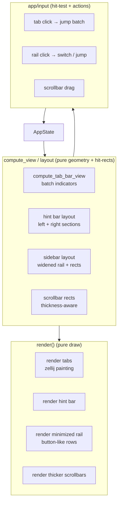
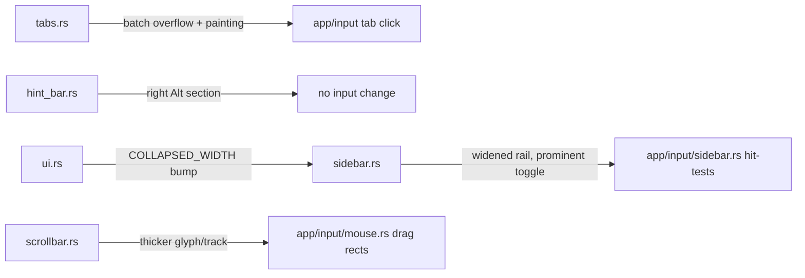

# Tab Bar, Bottom Bar & Sidebar UX — Detailed Design

## Overview

Herdr is a Rust/ratatui terminal workspace manager. A recent wave reworked tabs and the bottom hint bar toward a zellij-style look, but the result still falls short of zellij in five concrete ways. This design brings them to parity and improves the sidebar's minimized state, which matters most for mobile/web use.

The five workstreams, in the user's priority order:

1. **Tab overflow, zellij batch navigation.** Today herdr scrolls hidden tabs one at a time (`‹N` / `N›` chevrons), and before that it shrinks every tab to a uniform width and truncates names to `…` stubs. Zellij keeps the active tab full-width and readable and shows clickable `← +N` / `+N →` batch indicators that jump to the next group of hidden tabs at once. We port that behavior wholesale, including zellij's tab painting.
2. **Bottom bar, Ctrl-left / Alt-right.** The hint bar shows only mode-entry (Ctrl-style) shortcuts on the left. Add a right-aligned section surfacing the Alt quick-shortcuts that already exist in herdr's baseline bindings, matching zellij's left/right split and responsive degradation.
3. **Sidebar minimize (priority).** Make the expand/minimize toggle prominent, and turn the minimized rail into a genuinely usable, icon-only surface: wider than today, with button-like rows, click-to-switch, and status-driven jump.
4. **Thicker scrollbars.** The pane scrollback scrollbar and the sidebar list scrollbars are both 1-cell partial-block glyphs. Make them visibly thicker.
5. **Attention-aware overflow indicators.** When a space, agent, or tab that needs action is scrolled out of view, nothing tells you today. The overflow indicators learn to report not just how many items are hidden but how many of those need action, and clicking the badge jumps to the nearest one. The scrollbar tells you where you are; this tells you why you'd scroll.

This is refinement of existing, already-advanced implementations. The prior-art gate returned **Build**: external ratatui tab and split crates are simpler than what herdr already has. No new dependencies; the only config addition is `ui.tabs.powerline`.

## Detailed Requirements

### Goals & Success Criteria
- Tab overflow is navigable in batches: one action jumps to the next hidden group; the active tab is always visible.
- Bottom bar shows mode-entry shortcuts on the left and Alt quick-shortcuts on the right with zellij-quality painting and responsive degradation.
- The minimized sidebar is a usable interactive rail (wider, icon-only, button-like, click-to-switch + status-jump), and its expand button is visually prominent.
- Both scrollbars are visibly thicker.
- **Success measure:** placed side-by-side with zellij, herdr's tab overflow and bottom-bar layout read as equivalent; the minimized rail is operable on a phone via the web client.

### Functional Requirements
- **FR1** — Tab overflow uses a centered-active layout with clickable `← +N` / `+N →` collapsed indicators that jump to the nearest hidden tab on that side.
- **FR2** — Tab painting adopts zellij-style active/inactive/alternate coloring and (capability-gated) Powerline separators within herdr's palette.
- **FR3** — The hint bar renders a right-aligned Alt-shortcut section in addition to the left mode-entry section.
- **FR4** — The hint bar degrades responsively: full labels → short labels → drop the right (Alt) section → ellipsis, never overlapping the two sections.
- **FR5** — The minimized sidebar rail is widened (target 6–8 cols, clamped to terminal width) with icon-only rows rendered as button-like cells, preserving click-to-switch and adding status-driven jump for agent/pane attention states.
- **FR6** — The expand/minimize toggle is rendered prominently (distinct glyph + accent treatment) with a hit area at least as large as today's.
- **FR7** — Both pane and sidebar scrollbars are rendered thicker via a fuller thumb glyph and, where width budget allows, a 2-column track; 1-column fullness fallback otherwise.
- **FR8** — **Attention-aware overflow indicators.** When the spaces (workspace) list, the agent panel, or the tab bar has items scrolled out of view, the overflow indicator surfaces not just *how many* are hidden but *how many need action*. Format: `+N` for plain hidden count, augmented with an attention badge (e.g. `+3 ●²`) when ≥1 hidden item is in an attention state (awaiting input / done / error). The badge uses the attention color and is itself clickable to jump to the nearest hidden attention item. This applies to: the sidebar spaces list (a hidden space needing action), the agent panel (an agent below the fold waiting), and the tab `+N` batch indicators (a hidden tab whose pane needs action). Rationale: position (the scrollbar) tells you *where you are*; the attention badge tells you *why you'd scroll*.

### Non-Functional Requirements
- **NFR1** — `render()` stays pure; all geometry and hit-rects are computed in `compute_view`/layout helpers, never mutated during render (CLAUDE.md invariant).
- **NFR2** — No new crates; reuse ratatui buffer-glyph rendering already in `scrollbar.rs`/`tabs.rs`.
- **NFR3** — Every clickable rendered rect (batch indicator, minimized row, prominent toggle, widened scrollbar track) has an exactly-matching hit-test; click maps to the correct target.
- **NFR4** — Powerline separators are config-gated (`ui.tabs.powerline`, default ON) via an explicit painter parameter, never an environment probe; the OFF/`AlternatingBg` path emits zero Powerline codepoints and only single-cell-width glyphs, so a font-tofu terminal degrades to alternating backgrounds like zellij with no mojibake.
- **NFR5** — Touch-friendly: toggle and divider hit zones are at least 1 cell wider than their glyph; behavior holds in the mobile/web view.

### Scope (Out) / Non-Goals
- Not redesigning the agent panel's content model or the workspace data model. FR8 attention indicators **reuse** the existing attention/`seen`/`aggregate_state` model — no new state.
- Not adding new keybindings — Alt binds already exist; we only surface them. (assumption: surfacing existing binds is the intent, confirmed in Q3.)
- Not a theme overhaul — reuse the current `Palette`. The only config addition is `ui.tabs.powerline`.
- Multi-position resize-handle glyphs are a nice-to-have, explicitly deprioritized below minimize.
- Not changing scrollback storage or scroll math — only thickness/rendering.

### Acceptance Criteria
- **AC1** — With more tabs than fit, the active tab is always visible; `+N` indicators appear on each overflowing side; clicking one reveals the next batch (verified by unit tests on the layout function + a live read).
- **AC2** — The bottom bar shows Alt shortcuts right-aligned; under width pressure the Alt section truncates/drops before the left section, and the two never overlap.
- **AC3** — The minimized sidebar is wider, rows look button-like, clicking a workspace switches to it, and clicking an attention status jumps to that agent/pane.
- **AC4** — The expand button is visually distinct and at least as easy to hit as today.
- **AC5** — Both scrollbars are visibly thicker than today.
- **AC6** — `just check` passes; new layout/hit-rect logic is unit-tested.
- **AC8** — With a hidden space/agent/tab in an attention state, the relevant overflow indicator shows an attention badge with the action-needing count (not just total hidden); clicking it jumps to the nearest hidden attention item. With no hidden attention items, the indicator shows the plain count and no badge.

### Risks, Assumptions & Dependencies
- (resolved) Powerline glyph availability is handled by the `ui.tabs.powerline` config option (default ON) + `AlternatingBg` fallback, not a probed capability (FR2/NFR4). User has the fonts; fallback covers web/mobile.
- (assumption) Widening the minimized rail to 6–8 cols won't crowd narrow terminals. Mitigation: clamp relative to total width; keep a 4-col floor.
- Risk: a wider scrollbar track steals a content column. Mitigation: gate the 2-col track on available width; fall back to 1-col fuller glyph.
- Risk: stale drag latch on focus/tab switch (zellij issue #5251). Mitigation: clear drag state defensively on focus loss and tab change.
- Dependency: mouse hit-test plumbing (`on_sidebar_*`, tab click→index mapping, `DragTarget`) must change in lockstep with render changes (NFR3).

## Architecture Overview

Each workstream is isolated to one render module plus its matching input/hit-test path, preserving herdr's "state separated from runtime, render is pure" model.



### Module touch-map



## Components and Interfaces

### 1. Tab overflow — zellij batch navigation (`src/ui/tabs.rs`)

**Decision (full zellij port).** We replace herdr's *scroll tier* with zellij's centered-active balanced fill, and we keep zellij's readable-active-tab behavior rather than herdr's uniform compression. Rationale: herdr's compression shrinks every tab to a uniform width and truncates names to `…` stubs, which at high tab counts produces a row of unreadable fragments and then falls back to one-by-one scroll anyway. Zellij keeps the active tab full-width and readable and presents the rest as clean `+N` batches. The user explicitly prefers the zellij model.

**What exists today (grounding):** `compute_tab_bar_view` (tabs.rs:434) resolves in three tiers — uniform **compression** (`compress_tab_widths`, tabs.rs:320) → **scroll** (`centered_tab_scroll` + `‹N`/`N›` chevrons) → fallback. `tab_hit_areas` is a **dense vec, one Rect per tab, hidden tabs encoded as `width==0`**, with a runtime-asserted `len == tab_count` (actions.rs:1541). The active tab is already kept visible (`active_tab_never_hidden_*` tests). The genuine gap is batch `+N` jump indicators and full-width active-tab readability.

**Tier model after change:**
- **Tier 1 — natural fit** (unchanged): all tabs at natural width with 1-col gaps.
- **Tier 2 — REMOVED uniform compression.** We drop `compress_tab_widths` as the second tier. (The reviewers asked whether compression is kept; the answer is no — it is the very behavior we're replacing. Its tests are intentionally rewritten, see Testing.)
- **Tier 2′ (new) — centered-active batch fill.** Active tab placed first at natural (or capped-max) width; then add whole tabs alternately from the lighter side until the next tab would exceed available width, accounting for indicator widths including the "last hidden tab removes the indicator" optimization. Names are never ellipsis-compressed to fit more tabs; a single over-wide active tab is truncated only if it alone exceeds the bar.

**Identity-safe hit-test (addresses index-drift finding):**
- `tab_hit_areas` **stays a full-length dense vec indexed by tab index**; hidden/off-window tabs keep `width==0`. We do **not** compact to a visible-only list. This preserves the existing `len == tab_count` invariant and the `tab_at()` position→index contract (mouse.rs:1234).
- `jump_to` is explicitly a **tab index** (not a vec position), asserted in range against live tab count.
- New invariant (stronger than length): for every visible rect, `tab_at(rect.center)` round-trips to the same tab index, and the active tab's rect has `width > 0`. Enforced via `assert_invariants_for_test` with adversarial identity state.

**Indicator rendering.** `← +N` (left) / `+N →` (right), styled distinctly from real tabs (herdr `surface`/`overlay` bg). Cap at `+9+`/`+many` consistent with the current `9+` cap. Indicators carry the `jump_to` tab index and are clickable.

**Painting + Powerline (FR2 — user wants Powerline ON):** Add Powerline arrow separators (`` U+E0B0) between tabs, with inverted fg/bg on each side for the angled transition, exactly like zellij. Because herdr has **no font-capability detection today** and also runs in a web/mobile terminal whose font may lack the glyph, separators are gated by an explicit **config option `tabs.powerline` (default ON)** — not a probed capability. When OFF (or for users who hit tofu), the renderer falls back to zellij's own non-Powerline mode: alternating tab background colors as the separator. The painter takes an explicit `separator: SeparatorStyle` enum parameter (`Powerline | AlternatingBg`) so both paths are deterministically unit-testable (no environment probing). Active tab keeps `fg(panel_contrast_fg).bg(accent)`.

**Interface sketch:**
```rust
struct HiddenGroup { count: usize, jump_to: usize }   // jump_to is a TAB INDEX
struct TabBarOverflow { left: Option<HiddenGroup>, right: Option<HiddenGroup> }
enum SeparatorStyle { Powerline, AlternatingBg }
// compute_tab_bar_view returns: dense tab_hit_areas (len==tab_count) + Option<TabBarOverflow>
```

- **Hit-test (NFR3).** Tab-click mapping gains two cases: clicking the left/right indicator rect activates `jump_to`, which re-runs the centered layout and reveals the next batch. Visible-tab click mapping is unchanged.
- **Coupled code updated in lockstep (drop-indicator finding):** `tab_drop_indicator_x` (tabs.rs:602) and `tab_drop_index_at` (mouse.rs:1300) read the scroll hit-areas being removed; they must be re-pointed at the new indicator rects, and the `drop_indicator_x_*_when_*_clipped` tests (tabs.rs:1188) rewritten.
- **Stateless fill — `tab_scroll` removed (resolves round-2 must-fix).** The centered-active fill is computed purely from the active index + available width every frame, so it is **stateless**. `app.tab_scroll` **and its companion `tab_scroll_follow_active`** are **removed**, along with all writers (`actions.rs:976,1012,1110,1230-1245`, `api/tabs.rs:238`, `api/layouts.rs:173,554`) and the render reads (`can_scroll_left = ... && app.tab_scroll > 0`). The input-side tests that assert `tab_scroll == 1` (`input/sidebar.rs:1179` `clicking_tab_scroll_button_reveals_hidden_tabs_without_renaming`) are rewritten to assert indicator-click activates the `jump_to` tab id instead. This is explicitly added to the deletion/rewrite list (not left open).
- **Removed:** `compress_tab_widths` (as a tier), `TAB_SCROLL_BUTTON_WIDTH`, `centered_tab_scroll`, `max_tab_scroll`, the `‹N`/`N›` chevron render block + disabled states, `tab_scroll`, `tab_scroll_follow_active`.
- **Non-mouse branch (resolves round-2 must-fix).** `compute_tab_bar_view` has two branches: `!mouse_chrome` (tabs.rs:447, no scroll buttons/indicators) and `mouse_chrome` (tabs.rs:487). The `+N` indicators are mouse affordances (rendered only under `app.mouse_capture`). Both branches use the centered-active fill for tab *placement*; the difference is the overflow affordance: with mouse chrome, clickable `+N` indicators; **without mouse, the hidden count is shown as a non-clickable `← N`/`N →` marker** (keyboard users switch tabs via Tab-mode `h`/`l`/`goto`, which re-center the fill). Compression is not needed in either branch — the active tab stays readable and keyboard nav reaches every tab. Add a `!mouse_chrome` overflow test.
- **Unicode width (resolves round-2 must-fix, security).** Tab width math must use `UnicodeWidthStr` (as the hint bar already does), **not** `chars().count()` (tabs.rs:41,77,92), so CJK/combining/ZWJ tab names don't underestimate columns and break the round-trip invariant. Round-trip tests extended with adversarial wide/combining/ZWJ names.
- **Name sanitization (resolves round-2 should-fix, security).** Factor the existing `sanitize_key` approach into a shared helper applied to **tab/workspace `custom_name`** at the render chokepoint (`TabChrome::to_spans`, tabs.rs:82) — user-writable, persisted, ANSI-re-encoded on the web transport; the full-width readable active tab + inverted Powerline separators raise spoof value.
- **Complexity:** the centered fill is **O(visible)** per frame. Note this *replaces* today's O(n²) (`centered_tab_scroll`/`max_tab_scroll` each call O(n) `layout_tab_hit_areas` inside an O(n) loop) — a strict improvement.
- **Observability:** preserve the existing `"tab bar overflow"` tracing span (tabs.rs:563), extended with batch fields (`left_hidden`, `right_hidden`, `visible_count`).

### 2. Bottom bar — Ctrl-left / Alt-right (`src/ui/hint_bar.rs`)

Add a right-aligned Alt-shortcut section.

- **Data.** Extend `HintSet` with `alt_hints: Vec<Hint>` carrying the baseline Alt binds for the current mode (Terminal: `Alt+hjkl` focus, `Alt+n` split, `Alt+x` close, `Alt+=/-` resize, `Alt+i/o` move tab). Source key strings from `Keybinds` so remaps stay correct.
- **`Many`-binding resolution (addresses Alt-alternative finding).** Several focus/close binds are `BindingConfig::Many` where the *primary* alternative is `prefix+…` and the Alt form is *secondary*; the default `.first()` helper would yield `prefix+h`, not `alt+h`. The Alt section must **filter each `Many` binding to its Alt-modifier alternative** and render that. If the user has remapped a binding so no Alt alternative exists, that entry is **dropped** (not shown stale). Test: a workspace with focus remapped to a non-Alt chord must not display `alt+h`.
- **Sanitization (security finding — note the loop gap).** The existing `sanitize_key` loop (hint_bar.rs:575-603) iterates only `hint_set.hints`; a **new `alt_hints` vec is not touched by it**. So this is not "route through the existing chokepoint" — the placement pass for `alt_hints` must call `sanitize_key` explicitly (or the loop must be extended to cover both vecs). Add a characterization test that a bidi/control char in an Alt bind is stripped.
- **Single helper (round-2 should-fix, simplicity).** Add one `alt_binding_label` helper (sibling to `mode_binding_label`'s `.first()`) that extracts the Alt-modifier alternative from a `Many` binding; consume it once when building `alt_hints`, not inlined into a parallel builder.
- **Layout (FR3/FR4).** In `build_hint_line`, after composing the left section, compute the right section width and right-align it with zellij's manual padding: `pad = width - left_used - right_width`. Degradation order: full labels → short labels → drop the Alt section entirely → ellipsis on the left section. Assert `left_used + right_width <= width` before placing; otherwise drop the right section first. The two sections never overlap.
- **Painting.** Alt keys use `key_style` (accent + bold); labels dim. Optional subtle `│` separator between sections when both present and space allows.
- **No input change** — these binds already dispatch; the bar only displays them.

### 3. Sidebar minimize (priority) (`src/ui/sidebar.rs`, `src/ui.rs`, `src/app/input/sidebar.rs`)

**What exists today (grounding — interactivity is already wired).** The collapsed rail already renders icons (`render_sidebar_collapsed`, sidebar.rs:637) and is already interactive: `collapsed_agent_detail_target_at()` (input/sidebar.rs:351) maps a detail-row click to `(ws_idx, tab_idx, pane_id)`, and mouse.rs:519-532 already calls `switch_workspace(idx)` for workspace rows and `focus_pane_in_workspace(ws_idx, pane_id)` for detail rows. So **click-to-switch and status-jump already function.** The genuinely new work is width, button-like rendering, gating the jump on attention state, and a prominent toggle — not the input plumbing.

#### 3a. Widen the minimized rail (FR5)
- Replace the `COLLAPSED_WIDTH = 4` constant with `collapsed_width(total_width) -> u16` returning **4..=7** (target 7: `marker + pad + icon + pad`), clamped relative to total width with a hard 4-col floor. **Align with the existing width policy:** model the clamp on `effective_sidebar_width`'s style (sidebar.rs) rather than introducing a second parallel policy. The real edit site is **`compute_view_internal`** (ui.rs:187): it must pass `area.width` into `collapsed_width`, and the `debug_assert` tying laid-out width to `view.sidebar_rect` (ui.rs:201) must stay consistent.
- Render each row as a **button-like cell**: full-row background on active/selected/hover, centered icon with horizontal padding, optional 1-col attention marker. No text. The rendering must degrade gracefully across width 4→7 (icon/number must not collide at the 4-col floor — test both ends).

#### 3b. Status-driven interactivity (FR5, AC3) — refinement of existing behavior
- Click-to-switch (workspace rows) and focus-pane (detail rows) **already work**; verify they still resolve at the new width (`collapsed_workspace_at_row` uses `row - ws_area.y`, width-independent — should be safe, but add a test at the new width).
- The only new behavior: **gate the detail-row jump on an attention state** (awaiting input / done / error) so non-attention rows don't steal focus. Reuse the existing row-arithmetic target resolution; **do not** add a new `detail_rows: Vec<(PaneId, Rect)>` vector (the existing handler computes the target by arithmetic against `collapsed_sidebar_sections`).
- **NFR3 single-source-of-truth (testability finding):** refactor `render_sidebar_collapsed` so render and hit-test consume the **same** layout helper (a `CollapsedRailLayout` produced on the compute side) instead of the current inline `frame.buffer_mut()` row math, so render-rect == hit-rect can be asserted. The struct must carry the **divider** that the existing `collapsed_sidebar_sections` returns as its middle tuple element (`(ws_area, Some(divider_y), detail_area)`, sidebar.rs:613) — i.e. `CollapsedRailLayout { ws_area, divider_y: Option<u16>, detail_area, toggle }` — or render will keep recomputing the divider and the single-source claim is only partial. The `toggle` rect is sourced from `collapsed_sidebar_toggle_rect`; reconcile it into the struct.
- **Height floor (round-2 HIGH finding).** `collapsed_sidebar_sections` only yields a detail area when `content.height >= 7` (sidebar.rs:614-633). Below that there are **no detail rows**, so status-jump silently does nothing regardless of width. The width-boundary tests (width 4 and 7) must be joined by a **height-boundary** case (`height < 7` → no detail area, workspace rows still switchable). FR5/AC3 hold only above the height floor — state this explicitly.

#### 3c. Prominent expand/minimize toggle (FR6, AC4)
- Render the toggle with accent treatment (accent fg, bold, subtle background chip) and a hit area ≥1 cell larger than the glyph. Keep `»` (expand) / `«` (collapse). Ensure `collapsed_sidebar_toggle_rect` / `expanded_sidebar_toggle_rect` and their hit-tests match the enlarged target.

#### 3d. Mobile rendering check (addresses mobile-mode finding)
- The success measure is "operable on a phone via the web client," but `is_mobile_width` switches to a separate `render_mobile_*` path (ui.rs:182) that may bypass the sidebar entirely. **Before claiming the mobile AC, verify whether the widened collapsed rail renders in mobile mode or whether mobile uses a different surface.** If mobile bypasses the sidebar, either (a) wire the rail into the mobile path, or (b) restate the success measure to the narrow-but-non-mobile web case. Resolve during implementation Step 0.

#### 3e. Resize handle (nice-to-have, deprioritized)
- If time allows: a center grab glyph (`⋮`/`┃`) on the right divider and a ±1-cell wider hit zone. Not required for acceptance.

### 4. Thicker scrollbars (`src/ui/scrollbar.rs`)

- **Primary win — glyph fullness (always, low-risk).** Change the thumb to a full block (`█`) and the track to a denser glyph (`▓` or `│`→`┃`). This alone satisfies AC5 ("visibly thicker") with **zero geometry or hit-test change**, so it ships first and standalone. Note: `render_scrollbar` (scrollbar.rs:154) **hardcodes the track glyph `▕`** for all track cells regardless of the `thumb_symbol` param — that hardcoded literal is the edit site, not just a parameter.
- **2-column track (optional, width-gated, FR7) — demoted to nice-to-have.** Only if a 1-col fuller glyph proves insufficient. Where the owning layout has a spare column, reserve a 2-wide track. This requires lockstep edits: the rect helpers (`pane_scrollbar_rect`, `workspace_list_scrollbar_rect` sidebar.rs:487, `agent_panel_scrollbar_rect` sidebar.rs:542) return width 2 only when `body.width` can spare it, **and** the matching `*_body_rect` helpers must subtract 2 (not 1) for body width so content doesn't overlap the track. **Pin track `x = area.width.saturating_sub(2)`** to avoid the off-by-one buffer-index panic (writing one cell past the edge). `render_scrollbar` loops `track.x..track.x+track.width`.
- **Hit-test (NFR3).** If the 2-col track ships, scrollbar drag rects in `app/input/mouse.rs` widen to match so the thumb is grabbable across both columns.
- **Verify both call sites (round-2 LOW finding).** FR7 claims *both* pane and sidebar scrollbars are 1-cell partial blocks; only the pane path (`render_pane_scrollbar`, scrollbar.rs:177 — focused thumb is already `▐`) is evidenced. Confirm the sidebar callers (`workspace_list` / `agent_panel`) pass the same symbols before claiming one glyph swap covers AC5 for both; the focused-pane thumb change is `▐`→`█` (smaller jump) while unfocused `▕`→ fuller is the bigger visible change.
- **Pure-geometry note.** Width decisions live in the rect helpers (compute side), not in `render`.

### 5. Attention-aware overflow indicators (FR8) (`src/ui/sidebar.rs`, `src/ui/tabs.rs`)

The shared idea across all three lists: an overflow indicator reports `hidden_count` **and** `hidden_attention_count` (hidden items in an attention state). Compute both on the same single fill/scroll walk that already determines what's visible — no second O(n) rescan (scalability).

- **Spaces (workspace) list.** Today the collapsed rail and expanded spaces list iterate workspaces with no overflow affordance (sidebar.rs:659). Bound the rail to a **scroll-aware visible window** and render an overflow row/indicator when items are hidden: `+N` plain, or `+N ●ᵏ` when `k≥1` hidden spaces are in attention (`Workspace::aggregate_state` already gives per-workspace state). The badge is clickable → scroll/jump to the nearest hidden attention space.
- **Agent panel.** Same treatment for agents below the fold: `+N ●ᵏ` where `k` counts hidden agents awaiting input / done / error. Clickable → jump to nearest hidden attention agent.
- **Tab bar.** The `+N` batch indicators (Component 1) gain the same badge: a hidden tab whose pane needs action contributes to `k`, shown as `+3 ●²`. Reuses the indicator rect + `jump_to`; jump targets the nearest hidden **attention** tab when the badge is clicked, else the nearest hidden tab.
  - **Tab-bar plumbing (validation finding — DISPUTED "single walk" for tabs).** `compute_tab_bar_view` receives `Vec<TabChrome>`, and `TabChrome.status` is **insufficient** to derive attention: it's `None` under `TabStatusMode::Off` and is visibility-gated otherwise. The raw per-tab `(AgentState, seen)` tuple is computed in `build_tab_chrome` (the `source` element) but **discarded** at `build_tab_chromes` (tabs.rs:159-166). So FR8 must **thread per-tab attention into `compute_tab_bar_view`** — add an `is_attention: bool` to `TabChrome` (cheapest; computed from the already-derived `source` tuple) or pass a parallel `Vec<bool>`. This is render-time plumbing, **not** new state. The spaces list and agent panel need no such plumbing — their full entry lists + `(state, seen)` are already in scope at compute time.
- **Attention definition.** Reuse the existing attention/seen state model (`aggregate_state`, `agent_icon`, `seen`). `AgentState` is `{Idle, Working, Blocked, Unknown}` — there is **no `Error` variant**. An item is "attention" iff **`Blocked`** (awaiting input) **or `(Idle, seen=false)`** (done-unseen) — the same predicate `build_tab_chrome` and `tab_status_dot` already use. No new state model (Non-Goal preserved).
- **Color.** Attention badge uses the existing attention palette color (peach/red analog), distinct from the dim `+N` count.
- **Hit-test (NFR3).** Each badge is part of its indicator's clickable rect; clicking resolves to the nearest hidden attention item's jump target. Covered by the same single-source layout helper.

## Data Models

No persisted-state schema changes. New in-memory/render-time structures only:

```rust
// tabs.rs
struct HiddenGroup { count: usize, jump_to: usize } // jump_to is a TAB INDEX (range-asserted)
struct TabBarOverflow { left: Option<HiddenGroup>, right: Option<HiddenGroup> }
enum SeparatorStyle { Powerline, AlternatingBg } // explicit painter param, not env-probed
// tab_hit_areas stays a DENSE vec: len == tab_count, hidden tabs width==0 (invariant preserved)

// hint_bar.rs — extend existing HintSet
struct HintSet {
    badge: Badge,
    hints: Vec<Hint>,
    alt_hints: Vec<Hint>, // NEW: right-aligned quick shortcuts (Alt-alternative of Many binds, sanitized)
}

// sidebar.rs — render and hit-test consume ONE shared layout (NFR3 single-source-of-truth).
// Row targets are resolved by existing row-arithmetic; no new per-row PaneId rect vector.
// Carries the divider (middle element of collapsed_sidebar_sections) so render stops recomputing it.
struct CollapsedRailLayout {
    ws_area: Rect,
    divider_y: Option<u16>,
    detail_area: Rect,
    toggle: Rect,        // sourced from collapsed_sidebar_toggle_rect, reconciled into the struct
}

// overflow indicators (FR8) — shared shape for spaces list, agent panel, and tab bar
struct OverflowIndicator { hidden_count: usize, hidden_attention_count: usize, jump_to: usize }
```

`COLLAPSED_WIDTH` constant becomes `collapsed_width(total_width: u16) -> u16` returning **4..=7** — a small **independent** clamp (it is a free fn; `effective_sidebar_width` is an `AppState` method, so this borrows its *style*, not its signature). The load-bearing call site is `compute_view_internal` (ui.rs:187), which keeps the `view.sidebar_rect` / `debug_assert` consistent. Note the **height** precondition: `collapsed_sidebar_sections` needs `content.height >= 7` to yield a detail area.

Scrollbar rect helpers return `width: 1` by default; `width: 2` only in the optional width-gated path, with matching `*_body_rect` subtraction.

**Config addition:** `ui.tabs.powerline: bool` (default **ON**) — nested under the existing `ui` section (sibling to `ui.toast`/`ui.sound`), **not** a new top-level `tabs` key, because `KNOWN_TOP_LEVEL_CONFIG_KEYS` (config/io.rs:7-19) would flag an unknown top-level `tabs` and ignore it — which would defeat the very rollback the option exists to provide. Add a config roundtrip test. Selects `SeparatorStyle::Powerline` vs `AlternatingBg`. No persisted *state* schema change.

## Error Handling

- **Glyph rendering — config gate, not probe.** Powerline separators are selected by the `tabs.powerline` config option (default ON), passed to the painter as an explicit `SeparatorStyle` value — there is **no environment/font probing** (the codebase has no such capability path, confirmed). When OFF, the painter uses `AlternatingBg` (zellij's own fallback): no Powerline codepoints, only single-cell-width glyphs. A user who sees tofu can flip the option without a new binary (the missing rollback layer). The same caution applies to the "thicker" scrollbar glyphs: prefer glyphs that are unambiguously single-cell-width to avoid East-Asian-width cell shifting.
- **Width starvation.** Every layout function clamps with `saturating_sub` and honors a minimum: tab indicators drop before real tabs vanish; the Alt section drops before the mode badge; the scrollbar falls back to 1 col; the rail floors at 4 cols. A combined narrow-width test (rail + optional 2-col scrollbar + Alt section at the mobile threshold) asserts main content width ≥ a defined floor and no two hit-rects overlap; a `debug_assert` trips combined starvation in tests rather than on a phone.
- **Stale drag latch (new code, not "defensive").** `switch_tab` (actions.rs:1097) does **not** clear `self.drag` today; this is net-new behavior. Clear `self.drag` in `switch_tab`, on workspace switch, and on `OuterFocusLost` (runtime.rs:155 already handles that event). **The new `+N` indicator-jump path must route tab activation through the same `switch_tab` chokepoint** (so the clear fires there too) — if it activates via a different path, add the clear to that handler. Promote to an acceptance criterion with a test: press → move → (tab switch / **indicator jump** / workspace switch / OuterFocusLost) → move asserts no pane ratio / scroll offset changed and `self.drag.is_none()`. Matters most on web/mobile where mouse-up can be lost.
- **No `unwrap()`** in production paths (CLAUDE.md); use `saturating_*`, `get`, and `Option` combinators.

## Testing Strategy

Per CLAUDE.md, prefer `AppState::test_new()` / `Workspace::test_new()` unit tests next to the code; reserve live pane reads for visual confirmation.

- **Tab overflow (AC1):** unit-test the layout with N tabs > width: assert the active tab is visible **at full (untruncated) width**; assert `+N` groups and their `jump_to` **tab indices**; assert clicking an indicator reveals the next batch; assert width accounting (indicator-removal optimization) at boundary sizes.
- **Tab identity round-trip (index-drift finding) — attribution fixed.** `assert_invariants_for_test` (state.rs:1867) does **not** inspect `self.view`/`tab_hit_areas`, and `test_with_adversarial_identity_state` doesn't populate them. So the round-trip is a **dedicated test** that builds adversarial tabs, drives `refresh_tab_bar_view`, then asserts: `tab_hit_areas.len() == tab_count`; for every visible rect `tab_at(rect.center)` returns the same tab index; the active tab's rect has `width > 0`; clicking **each** visible tab and **each** `+N` indicator activates the exact expected **tab id** (not vec position). (Do not claim it's enforced by the shared invariant harness unless that harness is also extended.) Include adversarial **wide/combining/ZWJ tab names** to exercise the `UnicodeWidthStr` math.
- **Drop-indicator coupling:** rewrite `drop_indicator_x_*_when_*_clipped` tests against the new indicator rects; assert tab reorder-drag drops at the correct index when an edge is clipped.
- **Bottom bar (AC2):** unit-test `build_hint_line` at descending widths: full → short → right-section dropped → ellipsis; assert left+right never overlap; **boundary `pad==0` and `pad would be negative → drop right`** to pin the right-align off-by-one; assert the **Alt-modifier alternative** of a `Many` binding is shown; assert that remapping focus to a non-Alt chord **drops** the entry (no stale `alt+h`); assert a bidi/control char in an Alt bind is stripped (the new `alt_hints` vec is explicitly sanitized, not covered by the old loop).
- **Minimized rail (AC3):** layout test asserting `collapsed_width` returns exact values at boundary total-widths (floor 4, target 7) and that render and hit-test consume the **same** `CollapsedRailLayout`; assert rows render without icon/number collision at width 4 and 7; **height-boundary case** (`height < 7` → no detail area, workspace rows still switchable); hit-test asserting a workspace-row click switches workspace and an **attention** detail-row click focuses the right pane while a **non-attention** row does not. Adversarial identity state where pane identity matters.
- **Attention overflow (AC8, FR8):** with hidden spaces/agents/tabs, assert the indicator reports `hidden_count` and `hidden_attention_count` correctly; assert the badge renders only when `hidden_attention_count >= 1`; assert clicking the badge resolves `jump_to` to the nearest hidden **attention** item (and to nearest hidden item when no attention). Cover zero-hidden (no indicator) and hidden-but-no-attention (plain `+N`).
- **Toggle (AC4):** assert the enlarged toggle rect and that a click within it toggles `sidebar_collapsed`.
- **Mobile geometry (round-2 should-fix):** even if the render path bypasses the rail, assert `collapsed_width()` / `CollapsedRailLayout` produce **in-bounds, non-overlapping** rects at the mobile threshold (pure geometry, testable independent of the mobile render decision in §3d).
- **Config roundtrip:** `ui.tabs.powerline=false` parses, is **not** flagged unknown, and selects `SeparatorStyle::AlternatingBg`.
- **Scrollbars (AC5):** assert the thumb renders the intended fuller glyph; assert the **track no longer uses the hardcoded `▕`** (scrollbar.rs:154 — the real latent change) for both pane and sidebar callers; if the 2-col path ships, assert rect helpers return width 2 only when space allows (else 1), `*_body_rect` subtracts in lockstep, track `x == width-2`, and drag rects match.
- **Stale drag latch:** press → move → switch tab → move asserts `self.drag.is_none()` and no pane ratio / scroll offset changed; repeat for **indicator jump**, workspace switch, and `OuterFocusLost`.
- **Combined narrow-width:** rail + (optional) 2-col scrollbar + Alt section at the mobile threshold; assert main content width ≥ floor and no two hit-rects overlap.
- **Separator fallback (NFR4):** with `SeparatorStyle::AlternatingBg`, assert zero Powerline codepoints and only single-cell-width glyphs; with `Powerline`, assert the separator codepoint is emitted.
- **Regression / invariants:** run `AppState::assert_invariants_for_test()` after tab-jump and rail-click actions. This touches tab identity projection and UI/input state projection (refactor-risk per CLAUDE.md); protected behavior = active-tab-always-visible-and-readable + click→correct-target.
- `just check` (fmt + nextest + maintenance) must pass before commit.

## Appendices

### A. Mapping requirements → components
| Req | Component | File(s) |
|-----|-----------|---------|
| FR1, FR2 | Tab batch overflow + painting | `src/ui/tabs.rs`, `src/app/input/*` (tab click) |
| FR3, FR4 | Bottom bar Alt-right | `src/ui/hint_bar.rs` |
| FR5 | Widened interactive rail | `src/ui/sidebar.rs`, `src/ui.rs`, `src/app/input/sidebar.rs` |
| FR6 | Prominent toggle | `src/ui/sidebar.rs`, `src/app/input/sidebar.rs` |
| FR7 | Thicker scrollbars | `src/ui/scrollbar.rs`, `src/app/input/mouse.rs` |
| FR8 | Attention-aware overflow indicators | `src/ui/sidebar.rs`, `src/ui/tabs.rs`, `src/app/input/*` |

### B. Zellij reference behaviors (copied — full port)
- Centered-active tab fill with balanced left/right addition; active tab stays full-width and readable (replaces herdr's uniform name-truncating compression).
- Clickable `← +N` / `+N →` collapsed indicators jumping to the nearest hidden tab.
- Manual right-alignment of the secondary (Alt) bottom-bar section.
- Powerline separator (`tabs.powerline` ON by default) with alternating-background fallback.
See `research/zellij-tab-and-bar.md` for the algorithm and exact formats.

### C. Suggested implementation order (lowest-risk first)
1. **Thicker scrollbars — glyph-only (FR7):** swap thumb/track glyphs. Smallest, self-contained, satisfies AC5 alone. (2-col track deferred / optional.)
2. **Bottom bar Alt-right (FR3/FR4):** display-only; `Many`-binding Alt-alternative resolution + `sanitize_key`.
3. **Stale drag-latch clear:** clear `self.drag` in `switch_tab` / workspace switch / `OuterFocusLost` (independent prerequisite that de-risks 4).
4. **Sidebar minimize (FR5/FR6) — the priority:** `collapsed_width` 4..=7 via `compute_view_internal`; button-like rows; gate jump on attention; single-source `CollapsedRailLayout` (with `divider_y`); height-floor handling; verify mobile path (Step 0 of this item).
5. **Attention-aware overflow indicators (FR8):** spaces list + agent panel + tab `+N` badges; reuse `aggregate_state`/attention model; bound the rail to a scroll-aware visible window. Builds on 4 and (for tabs) 6.
6. **Tab batch overflow (FR1/FR2) — largest:** stateless centered-active fill + clickable `+N` indicators + Powerline/AlternatingBg painter; `UnicodeWidthStr` math; preserve dense `tab_hit_areas`; remove `tab_scroll`/`tab_scroll_follow_active`; non-mouse-branch overflow; update drop-indicator coupling. Touches tab identity + input — do last with the round-trip invariant tests.

### D. Rejected Feedback
(None. All critique findings were accepted or acknowledged. Two reviewer *recommendations* were overruled by explicit user direction, recorded here for traceability:)
- **"Drop Powerline separators entirely."** *Overruled by user* — the user wants Powerline arrows and has the fonts on the desktop. Resolution: ship Powerline **default ON** behind the `tabs.powerline` config option with an `AlternatingBg` fallback for terminals/fonts lacking the glyph (e.g. web/mobile), and an explicit painter parameter so both paths are testable. This keeps the desktop zellij look while preserving the safety the reviewers wanted.
- **"Scope tab overflow to minimal (indicators only), keep herdr's compression — it may be better."** *Overruled by user* — the user finds herdr's truncating compression worse than zellij and chose the full centered-fill port. Resolution: full port, with the identity-safety guardrails (dense hit-test vec, round-trip tests, drop-indicator + drag-latch fixes) the reviewers required to make it safe.

### E. Acknowledged Tradeoffs
- **Observability is limited by the TUI medium.** Broken glyphs and starved layouts have no client telemetry. Mitigations are the `tabs.powerline` escape hatch, the preserved/extended `"tab bar overflow"` tracing span, and combined-narrow-width tests — but a font-tofu case on an unknown user terminal can still go unreported until the user flips the option. Accepted as inherent to a terminal UI.
- **2-column scrollbar track deferred.** AC5 is met by the glyph swap alone; the 2-col track (and its body-width/hit-rect lockstep edits + panic-boundary pin) is optional, pursued only if 1-col fullness proves insufficient. Avoids the most likely new panic surface.
- **Full zellij port disturbs ~40 tab-layout tests.** Removing the compression tier intentionally rewrites the `compression_activates_before_scroll_*` and `compress_*` characterization tests. Accepted as the cost of the chosen UX; the active-tab-visible/readable and click→correct-target invariants are the protected behaviors carried forward.
- **`tabs.powerline` adds a config surface.** A new option to document and default-manage, justified by the user's explicit desire for Powerline plus the web/mobile fallback need.
