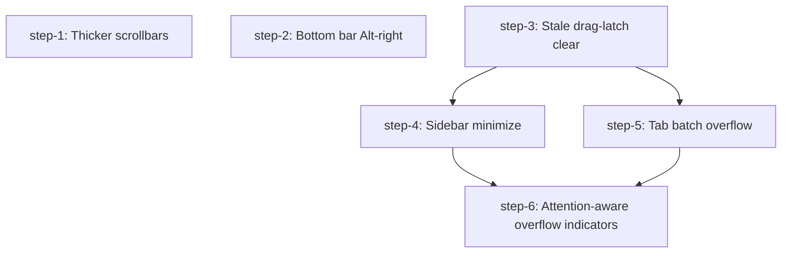

# Implementation Plan

Design: .agents/planning/2026-06-22-tab-sidebar-ux/design/detailed-design.md
Created: 2026-06-23
Tasks: 6

## Metadata
- ship: per-step

## Dependency Graph

Steps 1, 2, and 3 are independent and can run in parallel. Step 4 depends on step 3. The rail's click-to-switch (workspace) and pane-focus paths are new or refined activation surfaces in the priority step's headline web/mobile environment, where mouse-up can be lost, so the drag-clearing chokepoints must exist first. Design §C calls step-3 an "independent prerequisite that de-risks 4." Step 5 also depends on step 3, since the new indicator-jump path routes through the drag-clearing chokepoint. Step 6 depends on step 4 (sidebar rail) and step 5 (tab `+N` indicators) because it adds attention badges to both surfaces.

**Scheduling note:** step-6 is the design's headline differentiator (FR8) yet is the most-blocked step, gated behind both the largest step (5) and the priority step (4). Step-6 is itself splittable along its dependency edges. The spaces-list and agent-panel badge halves depend only on step-4 and can land ahead of the tab-badge half, which needs step-5. If step-5 slips, the step-4-only halves of step-6 need not wait. Within those step-4-only halves, the scroll-aware visible-window work is an internal sub-prerequisite: land the windowing first, then the badges that count attention over the hidden set.

## Acknowledged Tradeoffs

Carried from the design (Appendix E):
- Observability is limited by the TUI medium; font-tofu on an unknown terminal can go unreported until the user flips `ui.tabs.powerline`.
- The 2-column scrollbar track is **descoped from this plan**, not merely deferred. AC5 is fully met by the step-1 glyph swap alone, and step-1 passes without the 2-col track. If a future pass pursues it, the matching drag-rect and body-width lockstep edits go with it. (Critique #7)
- The full zellij tab port intentionally rewrites ~40 compression characterization tests.
- `ui.tabs.powerline` adds a config surface to document and default-manage.

From the critique loop:
- **step-5 is kept as one cohesive step** despite being the largest. Its own design calls it "the largest." The work shares one function, struct, and test surface (`compute_tab_bar_view`, `TabChrome`, the tab-layout test module), and the drop-indicator re-coupling is structurally tied to the scroll-tier removal, so a clean atomic split is not available. The implementor should land it as a sequence of internal commits. Suggested sub-phases: (a) stateless centered fill, dense-vec round-trip, `tab_scroll`/`tab_scroll_follow_active` removal, non-mouse branch, drop-indicator re-coupling; (b) Powerline/AlternatingBg painter and `ui.tabs.powerline` config; (c) Unicode-width math and name sanitization. The single `just check` gate is the step's acceptance boundary. The sub-phases are landing granularity, not separate acceptance gates. (Critique #1, user-confirmed)
- **The spaces-list scroll-aware visible window** that FR8 needs does not exist today. The rail iterates workspaces with no overflow affordance. Creating it is a prerequisite captured inside step-6's criteria. It is internal to step-6 and adds no new DAG edge. (Critique #5)
- **NFR2 (no new crates):** no step adds a dependency. This is a plan-wide constraint rather than a per-step criterion. A stray `Cargo.toml` dependency in any step's diff is a plan violation. (Critique #9)
- **AC7 does not exist:** the design's acceptance-criteria numbering jumps AC6 → AC8. This is an intentional design-side gap, not a dropped requirement. (Critique #8)
- **NFR5 divider hit-zone clause is descoped with §3e.** NFR5's toggle clause is covered (step-4) and its `+N`/badge clause is covered (steps 5/6), but its resize-handle/divider clause lives in the deprioritized §3e and is not an acceptance gate. If §3e is pursued later, the wider divider hit zone goes with it. (round-2 critique)

## Rejected Feedback

- **"No step has a live-read / visual-parity acceptance gate."** *Rejected* — the validator itself classed this DISPUTED-as-defect. CLAUDE.md testing doctrine mandates `AppState::test_new()`/`Workspace::test_new()` unit tests as the gate and reserves live pane reads for out-of-band visual confirmation. Forcing a live read into an acceptance gate would contradict that doctrine. Visual "zellij parity" is confirmed out-of-band, by design, not machine-gated. (round-3)

## Tasks

### step-1: Make both pane and sidebar scrollbars visibly thicker via fuller glyphs

- **Acceptance criteria:**
  - [ ] The scrollbar thumb renders a fuller glyph than today for both the focused-pane path and the unfocused/sidebar paths.
  - [ ] The scrollbar track no longer uses the hardcoded `▕` literal; the track glyph is visibly denser.
  - [ ] Both the pane scrollback scrollbar and the sidebar list scrollbars (workspace list, agent panel) are visibly thicker than today.
  - [ ] No geometry or hit-test change is required for the glyph swap; existing scrollbar drag continues to work unchanged.
  - [ ] Unit tests assert the thumb renders the intended fuller glyph and that the track no longer emits the hardcoded `▕` for both pane and sidebar callers.
  - [ ] `just check` passes.
- **Dependencies:** none (can start immediately)
- **Affected areas:** `src/ui/scrollbar.rs`; `src/ui/sidebar.rs` only if the sidebar callers (`workspace_list_scrollbar_rect` / `agent_panel_scrollbar_rect`) pass their own thumb/track symbols rather than inheriting the centralized glyph — confirm during the step and include if so.

### step-2: Add a right-aligned Alt-shortcut section to the bottom hint bar

- **Acceptance criteria:**
  - [x] The hint bar renders a right-aligned Alt-shortcut section in addition to the left mode-entry section, sourcing key strings from the active keybinds so remaps stay correct.
  - [x] For `Many` bindings whose Alt form is a secondary alternative, the Alt section shows the Alt-modifier alternative (not the primary `prefix+…` form); if no Alt alternative exists after a remap, that entry is dropped rather than shown stale.
  - [x] Alt-shortcut entries are sanitized for control/bidi characters explicitly (the new section is not covered by the pre-existing sanitize loop over the left hints).
  - [x] Under width pressure the bar degrades in order: full labels → short labels → drop the Alt section entirely → ellipsis on the left section; the two sections never overlap (left_used + right_width ≤ width is enforced before placement, including the pad==0 and would-be-negative boundaries).
  - [x] No input/dispatch change — the bar only displays binds that already dispatch.
  - [x] Unit tests cover descending widths with each FR4 tier exercised as a distinct transition (full labels → short labels → Alt-section dropped → ellipsis — the short-label tier is asserted separately, not collapsed into "narrower"), the Many-binding Alt-alternative resolution, the drop-on-remap case, and the sanitization of a bidi/control char in an Alt bind.
  - [x] `just check` passes.
- **Dependencies:** none (parallel with step-1, step-3, step-4)
- **Affected areas:** `src/ui/hint_bar.rs`

### step-3: Clear stale drag state on tab switch, workspace switch, and outer focus loss

- **Acceptance criteria:**
  - [ ] Active drag state is cleared when switching tabs, switching workspaces, and on the outer-focus-lost event.
  - [ ] The existing tab-activation paths route through a single tab-switch chokepoint where the clear fires (step-5's new indicator-jump path is then routed through that same chokepoint and tested there).
  - [ ] A press → move → (tab switch / workspace switch / outer-focus-lost) → move sequence leaves drag state cleared and changes no pane ratio or scroll offset.
  - [ ] Unit tests cover each of the three clear triggers.
  - [ ] `just check` passes.
- **Dependencies:** none (parallel with step-1, step-2, step-4)
- **Affected areas:** `src/app/actions.rs`, `src/app/runtime.rs`

### step-4: Widen the minimized sidebar rail into a button-like interactive surface with a prominent toggle

- **Acceptance criteria:**
  - [ ] The minimized rail width is computed by a function returning 4..=7 columns, clamped relative to total terminal width with a hard 4-col floor, wired through the main view computation so the laid-out width and the sidebar rect / debug assert stay consistent.
  - [ ] Each minimized row renders as a button-like cell (full-row background on active/selected/hover, centered icon with padding, optional 1-col attention marker, no text), degrading without icon/number collision at both the 4-col floor and the 7-col target.
  - [ ] Clicking a workspace row switches to that workspace; clicking a detail row in an attention state (awaiting input / done-unseen) focuses the corresponding pane, while a non-attention detail row does not steal focus.
  - [ ] The rail-click workspace-switch and pane-focus paths route through the same drag-clearing chokepoints established in step-3, so a stranded drag latch cannot survive a rail click (matters most on web/mobile where mouse-up can be lost).
  - [ ] Render and hit-test consume the same shared collapsed-rail layout (carrying ws_area, divider_y, detail_area, and the toggle rect) so render-rect equals hit-rect.
  - [ ] Below the detail-area height floor, status-jump does nothing while workspace rows remain switchable (height-boundary behavior is explicit).
  - [ ] The expand/minimize toggle is rendered with distinct accent treatment and a hit area at least 1 cell larger than its glyph; its rect and hit-test match the enlarged target.
  - [ ] The resize-handle glyph + widened divider hit zone (design §3e) is **out of scope** for this step (nice-to-have, deprioritized); its NFR5 divider-clause is not an acceptance gate here.
  - [ ] The mobile/web rendering path is verified. If the widened rail does not render in mobile mode, restating the design's top-line "operable on a phone via the web client" success measure is a recorded design-level decision (surfaced for sign-off), not a unilateral step outcome that silently lowers the bar.
  - [ ] Geometry and hit-rects are computed compute-side (layout helpers), with no state mutation during `render()`; `AppState::assert_invariants_for_test()` passes after a rail-click action (this step touches UI/input state projection — refactor-risk per CLAUDE.md).
  - [ ] Unit tests cover boundary widths (4 and 7), the height-boundary case, workspace-row switch, attention vs non-attention detail-row jump, the enlarged toggle hit-test, and in-bounds non-overlapping rects at the mobile threshold.
  - [ ] `just check` passes.
- **Dependencies:** step-3 (rail-click switch/focus paths route through step-3's drag-clearing chokepoints); parallel with step-1 and step-2
- **Affected areas:** `src/ui/sidebar.rs`, `src/ui.rs`, `src/app/input/sidebar.rs`

### step-5: Replace tab compression/scroll with stateless centered-active batch overflow and zellij-style painting

- **Acceptance criteria:**
  - [ ] With more tabs than fit, the active tab is always visible at full (untruncated) width; clickable `← +N` / `+N →` collapsed indicators appear on each overflowing side and jump to the nearest hidden tab on that side when clicked.
  - [ ] The centered-active fill is stateless (computed from active index + available width each frame); the prior scroll state fields and all their writers/readers, the uniform-compression tier, the scroll-button widths, the chevron render block, and related helpers are removed.
  - [ ] `tab_hit_areas` stays a dense vec with length equal to tab count (hidden tabs width 0); jump targets are tab indices, range-asserted against live tab count.
  - [ ] For every visible tab rect, a position→index round-trip returns the same tab index, and the active tab's rect has width > 0; clicking each visible tab and each `+N` indicator activates the exact expected tab id.
  - [ ] Tab width math uses Unicode display width (not char count) so CJK/combining/ZWJ names compute correct columns; user-writable tab/workspace custom names are sanitized at the render chokepoint.
  - [ ] The active tab renders with accent background / contrast foreground, and inactive/alternate tabs render the specified distinct zellij-style coloring (FR2's tab-coloring half, separate from the separator half below).
  - [ ] Powerline arrow separators render when `ui.tabs.powerline` is ON (default) and fall back to alternating-background separators when OFF, selected via an explicit painter parameter (no environment probing); the OFF path emits zero Powerline codepoints and only single-cell-width glyphs.
  - [ ] The clickable `+N` indicator has a touch-adequate hit zone (NFR5) so it is operable on a phone, not a 1-cell-wide target.
  - [ ] `ui.tabs.powerline` (nested under `ui`, default ON) parses, is not flagged as an unknown key, round-trips, and selects the separator style; a config roundtrip test covers the OFF value.
  - [ ] Without mouse chrome, the hidden count shows as a non-clickable marker; both branches use the centered-active fill for placement.
  - [ ] The drop-indicator coupling (drag-reorder insertion x / index) is re-pointed at the new indicator rects and its tests rewritten; tab reorder-drag drops at the correct index when an edge is clipped.
  - [ ] The indicator-jump tab activation routes through the same tab-switch chokepoint that clears drag state (from step-3); a press → move → indicator-jump → move test asserts drag is cleared and no pane ratio / scroll offset changed (the indicator-jump path is born here, so this test lives in this step, not step-3).
  - [ ] Unit tests cover the layout at N tabs > width (active visible at full width, `+N` groups and jump indices, indicator click reveals next batch, width accounting at boundaries), the identity round-trip with adversarial wide/combining/ZWJ names, the non-mouse overflow branch, and the separator Powerline/AlternatingBg paths; `AppState::assert_invariants_for_test()` passes after a tab-jump action.
  - [ ] `just check` passes.
- **Dependencies:** step-3 (the indicator-jump path routes through the drag-clearing tab-switch chokepoint)
- **Affected areas:** `src/ui/tabs.rs`, `src/app/input/mouse.rs`, `src/app/input/sidebar.rs` (the `clicking_tab_scroll_button_...` test rewrite lives here), `src/ui.rs`, `src/app/state.rs`, `src/config/`, `src/app/actions.rs`

### step-6: Add attention badges to the spaces list, agent panel, and tab `+N` overflow indicators

- **Acceptance criteria:**
  - [ ] Each overflow indicator reports both the hidden count and the hidden-attention count, computed on the same single fill/scroll walk that determines visibility (no second O(n) rescan).
  - [ ] An attention badge (e.g. `+3 ●²`) renders only when at least one hidden item is in an attention state, using the attention palette color, distinct from the plain dim `+N`; with no hidden attention items the indicator shows the plain count and no badge.
  - [ ] The badge is clickable and jumps to the nearest hidden attention item (falling back to the nearest hidden item when none is in attention) for all three surfaces: the sidebar spaces list, the agent panel, and the tab `+N` batch indicators.
  - [ ] Each surface's jump target type is defined and range/identity-asserted (mirroring step-5's tab-index contract): the spaces-list badge resolves to a valid workspace target, the agent-panel badge to a valid agent/pane target, and the tab badge to a valid tab index — a jump that lands on the wrong item fails its test.
  - [ ] The spaces-list badge jump actually advances the scroll-aware window so the resolved target is no longer hidden after the click (mirroring step-5's "indicator click reveals the next batch" — resolving the index alone is insufficient).
  - [ ] Whether the agent-panel badge-jump (a pane-focus action, not a workspace/tab switch) needs to clear drag state is explicitly decided: either it routes through a drag-clearing path, or the plan states focus-pane cannot strand a drag latch — not left unaddressed.
  - [ ] The attention badge has a touch-adequate hit zone (NFR5) on all three surfaces so it is operable on a phone.
  - [ ] The spaces list and agent panel reuse the existing aggregate/attention/seen state model with no new persisted state; the attention predicate is Blocked or (Idle, seen=false).
  - [ ] Per-tab attention is threaded into the tab-bar view computation (the raw per-tab state/seen currently discarded) without introducing new persisted state.
  - [ ] The sidebar rail is bounded to a scroll-aware visible window so hidden spaces/agents are actually detectable (this windowing does not exist today and is a prerequisite for the spaces-list half of FR8).
  - [ ] The tab-bar attention work re-runs and preserves the step-5 identity round-trip and `AppState::assert_invariants_for_test()` — adding per-tab attention plumbing mutates the same `TabChrome` / `compute_tab_bar_view` surface step-5 stabilized, so those invariants are re-verified, not assumed.
  - [ ] Geometry and hit-rects are computed compute-side with no state mutation during `render()`; the attention badge is part of its indicator's clickable rect.
  - [ ] Unit tests cover correct hidden/hidden-attention counts, badge-renders-only-when-attention, click resolves to nearest hidden attention item (and nearest hidden when none), zero-hidden (no indicator), and hidden-but-no-attention (plain `+N`).
  - [ ] `just check` passes.
- **Dependencies:** step-4 (sidebar rail surfaces), step-5 (tab `+N` indicator rects + jump path; step-6's tab-attention plumbing re-opens the `TabChrome`/`compute_tab_bar_view` structure step-5 stabilizes)
- **Affected areas:** `src/ui/sidebar.rs`, `src/ui/tabs.rs`, `src/app/input/sidebar.rs`, `src/app/input/mouse.rs`
