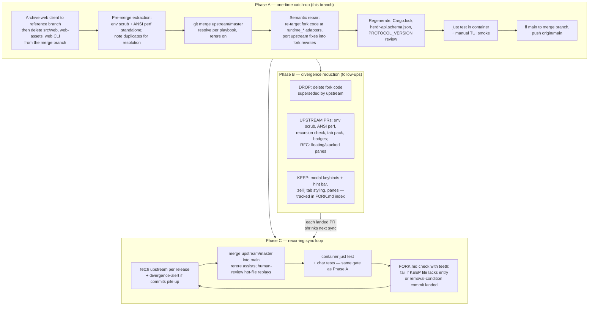

# Upstream Merge Strategy for the herdr Fork

## Overview

The fork (`ajessu/herdr`, branch `main`) has drifted from upstream
(`ogulcancelik/herdr`, branch `master`): 80 commits ahead, 209 behind, merge-base
2026-06-15. Upstream shipped three releases, a plugin **marketplace** (the plugin
scaffolding at `src/app/api/plugins/`, `src/cli/plugin.rs`,
`src/persist/plugin_registry.rs` already exists at the merge-base and is shared
history the fork carries today: only `workers/plugin-marketplace/` and the
marketplace UI are net-new upstream), and a runtime-authority refactor that moved
the exact code paths several fork features hook into. The plugin-fit analysis
below is therefore about which fork features map onto the *existing* plugin
surface, not about adopting a plugin system the fork lacks.

This design selects and validates an integration strategy (merge, not rebase),
assigns a disposition to every fork feature area (drop / convert to plugin /
propose upstream / keep as fork patch), and defines a recurring sync process so
the fork never again drifts 200+ commits. Both candidate strategies were tested
empirically on this branch before choosing.

Prior art (gate verdict: Extend, confidence 90): fork-sync automation such as
`aormsby/Fork-Sync-With-Upstream-action` and merge-upstream marketplace actions
cover the *mechanics* of recurring syncs, and the repo already has an in-repo
analogue in the libghostty-vt vendor+patch-index workflow. What prior art does
not provide, and what this design adds, is the merge-vs-rebase decision for
this specific divergence, the plugin-fit analysis of fork features against
upstream's new plugin surface, and the divergence-reduction plan. The recurring
process below deliberately borrows the patch-index idea from the libghostty-vt
workflow rather than inventing a new tracking scheme.

## Detailed Requirements

### Goals & Success Criteria

- Fork `main` contains all of `upstream/master` (through 3661d99), compiles, and
  passes `just test` via `scripts/test-host.sh`.
- Kept fork features still work: modal keybinds + hint bar, zellij tab bar,
  the retained sidebar work (overflow badges, status dots, 7-col rail,
  responsive width ratio: the toggle chip and close button were already
  reverted to upstream defaults in a1804a8), floating panes, stacked panes.
- Dropped features are cleanly removed, not half-present: the web client
  (src/web/, web-assets/, `herdr web` CLI, web feature gate, trust-proxy,
  touch scroll) is preserved on a reference branch (`archive/web-client`) and
  deleted from `main`; the herdr-tunnel script goes with it. Scope decision by
  the user 2026-07-12: their browser access is a standalone web terminal, not
  the fork client, so the fork's largest patch (~4.7k lines on internals
  upstream refactors freely) buys nothing.
- A written, repeatable sync process exists. Success metric, with defined units
  and baseline (finding 8/15): **standing divergence** = `git rev-list --count
  upstream/master..main` (fork-only commits) and **standing diff size** =
  `git diff --shortstat $(git merge-base main upstream/master)..main` (files +
  lines). Baseline at this design: 80 fork commits, 96 files / +26.5k lines.
  Target: each per-release sync lands in one working session, and both numbers
  trend down release over release as Phase B dispositions land. A sync that
  leaves divergence higher than the prior release is a regression to investigate,
  not silent drift.

### Functional Requirements

1. One-time catch-up integration of the 209 upstream commits.
2. A per-feature disposition for each fork feature area (Section "Data Models"),
   grounded in evidence from the research files.
3. Recurring sync mechanics: strategy, cadence, rerere, verification.
4. Compliance path for upstream's runtime-authority guardrail so kept fork
   features stop mutating `AppState` directly where upstream now routes through
   `runtime_*` adapters.

### Non-Functional Requirements

- Do not disrupt the user's live herdr session without asking: rebuild only,
  swap via `scripts/swap-restart.sh` on request. (Revised: the user's browser
  access is a standalone web terminal independent of herdr, so the earlier
  "web access depends on the server staying up" constraint is obsolete: ordinary session courtesy remains.)
- All builds and tests run in the container (`scripts/test-host.sh`); host glibc
  2.26 cannot run direct cargo builds. Upstream pins Rust 1.96.1, so the
  container image must provide it before the merge lands.
- `origin/main` history must not be rewritten: it is the base of ~25 local
  branches/worktrees and any rewrite orphans all of them. Note: `main` has
  advanced to a1804a8 (sidebar backtrack) since this design's measurements at
  3e93d5f; the real merge starts from a1804a8.

### Scope (Out) / Non-Goals

- Actually landing upstream PRs (follow-up work; the external-contributor
  guardrail requires discussion → accepted issue → approved PR per feature).
- Windows validation, ja/zh-cn doc translation for fork features.
- Building a plugin-hosted modal-keybind mechanism (the user's hoped-for
  long-term home for the zellij modal system; upstream plugins cannot own
  input dispatch today, so this is aspirational, not planned work).
- (Removed from scope by the web-client drop: tunnel plugin, per-pane web
  bridge plugin, observe/control re-architecture: all were web-client
  descendants.)

### Acceptance Criteria

- Empirical merge and rebase measurements recorded (done: research file 01).
- Chosen strategy with rationale, including why the alternative was rejected.
- Disposition table covering every fork feature area with evidence.
- Step-ordered integration plan: preflight, pre-merge extraction, merge,
  characterization tests, semantic repair, regen, verification, land.
- An executed POC proving the plan: the merge actually performed, resolved,
  and built, with the final test-suite verdict recorded in `research/04` (R2:
  "tested" is only claimable once that file carries the completed nextest
  result and an accounting of every failure, not a pending marker).
- Documented recurring sync process with cadence, commands, and verification.

### Risks, Assumptions & Dependencies

- **Risk: semantic conflicts dominate, and `just test` is not a complete net.**
  Upstream's runtime-authority refactor means fork modal dispatch, alt shortcuts,
  and tab mutations need re-targeting at `src/app/runtime_mutations.rs` adapters
  after the merge compiles. The critique surfaced that "compile + just test"
  under-verifies this: the repo's own convention mandates manual smoke precisely
  because the suite has coverage gaps on modal dispatch, the tab painter, and
  sidebar geometry. Mitigation (finding 2): before semantic repair begins, write
  characterization tests pinning the AppState effects of each re-targeted path
  (modal `ModeAction` dispatch, `MoveTabLeft/Right`, `ResizeGrow/Shrink`,
  `break_pane_to_tab`, tab context-menu actions) using `AppState::test_new()`, so
  the re-target is verified against a captured baseline rather than by eye. These
  tests also become the permanent guard for every future sync.
- **Risk: snapshot schema drift corrupts live sessions on restore (CRITICAL,
  finding 1).** The merge changes `src/persist/snapshot.rs` (fork stack/floating/
  sidebar-ratio fields) and makes those fields API-visible via upstream's session
  snapshot API. If the on-disk format drifts, the running fork build's saved
  sessions fail to restore on the merged build, and once the new build rewrites
  snapshots, rolling back to the old build can no longer read them (forward-
  incompatible = silent data loss). Mitigation: capture a corpus of real
  pre-merge snapshots now; add a characterization test that deserializes them
  through the merged build and asserts a clean restore or an explicit versioned
  migration; confirm/introduce a snapshot format-version field; back up the live
  snapshot directory before the first swap so rollback is always possible.
- **Risk: keybind schema reconciliation, indefinitely (finding 12).** Fork's
  modal `[keys.*]` schema must absorb three upstream behaviors it lacks
  (user-displaces-default `BindingSource`, shifted indexed keys, help ranges).
  This is the single largest one-time reconciliation item, and because
  `config/model.rs` churns ~13x/upstream-window and keybind semantics ~2x, it
  recurs every sync. The base choice (keep fork modal schema vs. adopt upstream's
  `BindingSource` substrate and layer modes on top) is revisited as an explicit
  Acknowledged Tradeoff rather than assumed.
- **Risk: rerere is over-credited for the hot files (finding 5).** rerere only
  replays when conflict *content* matches a prior recording. The highest-churn
  files (`app/mod.rs` ~21 upstream commits since base, `server/headless.rs` ~19,
  `config/model.rs` ~13) present *different* hunks each sync, so rerere mostly
  misses exactly the runtime-authority collision zone where help is most wanted.
  Mitigation: treat rerere as an accelerator for stable low-churn conflicts
  (docs, Cargo.lock patterns) only; in Phase C, human-review every rerere
  auto-resolution touching a guaranteed-heavy-conflict file before building;
  wrong entries are erasable with `git rerere forget <path>`.
- **Risk: big-bang catch-up stalls and becomes unlandable (finding 9).** A single
  atomic Phase A can drag while upstream keeps moving (~50 commits/week),
  diverging further than it started. Mitigation: extract the low-risk
  UPSTREAM-CANDIDATE commits (env scrub, ANSI perf) as standalone commits first to
  shrink the conflict surface; set an explicit timebox for the semantic-repair
  window; re-measure `upstream/master..HEAD` divergence during repair so a stall
  is visible, not discovered weeks later.
- **Risk: downstream wave branches inherit the repair (finding 10).** Not
  force-pushing protects the ~25 worktrees' *ancestry* but not their
  *mergeability*: each wave branch carries fork features on the same mutation
  paths upstream moved, so when it next merges onto the advanced `main` it faces
  the same runtime-authority re-target. Mitigation: after the FF, sweep
  `git log origin/main..<branch>` for unpushed work, flag branches touching
  `app/input/`, `actions.rs`, `state.rs`, and record the direct-mutation →
  `runtime_*` migration recipe in `FORK.md`; some branches may be cheaper to redo
  on the new base than to merge.
- **Risk: a bad swap disrupts the live session (finding 3, revised).** The
  original finding assumed web access depended on the herdr server; the user
  clarified their browser access is a standalone web terminal, so the
  circular-recovery-channel concern is void. What remains: a swap that passes
  `just test` but crashes live still loses the user's session state.
  Mitigation: stage the previous known-good binary for one-command revert, and
  swap only on explicit user request.
- **Risk: incoming supply-chain surface (finding 11).** 209 upstream commits and
  the newly-reachable marketplace pull in unsandboxed plugin execution (raw
  socket, install-time argv). Mitigation: a focused review pass over incoming
  process-spawn / socket / auth / plugin-execution diffs and remote tag
  verification before fetch; see Acknowledged Tradeoffs for the residual.
- **Risk: vendored libghostty-vt patches stop reverse-applying (finding 17).**
  Both sides vendor libghostty-vt; `just check` fails if a fork patch no longer
  reverse-applies against the merged vendored tree. Mitigation: re-verify the
  patch index against the merged tree as an explicit regen step.
- **Assumption:** upstream `master` stays the integration target; fork `main`
  stays the fork default branch.
- **Fact (verified):** upstream's mobile switcher is a narrow-width TUI mode,
  not a web client. With the fork web client dropped, this TUI mode plus the
  user's standalone web terminal IS the mobile story going forward.
- **Dependency:** container image with Rust 1.96.1 (front-loaded as a step-0
  preflight gate, not just a listed dependency); `upstream` remote fetchable.

## Architecture Overview

The strategy has three layers: a one-time catch-up, a standing divergence-
reduction pipeline, and a recurring sync loop.



### Strategy decision: merge, not rebase

Both were measured on this branch (research file 01):

| | Single merge | Full rebase (80 commits) |
|---|---|---|
| Conflict interactions | 1 stop, 32 files, ~94 hunks | 16 stops, 31 files, 42 hunks |
| Context per hunk | mixed, harder to attribute | single-commit, locally obvious |
| History effect | none — `main` keeps its hashes | rewrites `main` → force-push |
| Worktree impact | none | orphans ~25 local branches/worktrees |
| Cherry-picked commit (98c810a) | auto-resolves against 5449025 | replays as a conflict |
| rerere benefit for future syncs | accumulates on merge conflicts | reset by each rewrite |

The rebase is genuinely more pleasant per-stop, but history rewrite is
disqualifying: `origin/main` anchors ~25 worktrees, and the semantic-repair work
(identical under both strategies) dwarfs the textual-resolution difference.
**Decision: merge `upstream/master` into `main`, resolved once on this `merge`
branch, then fast-forward `main`.** Future syncs are also merges, keeping one
uniform mechanism that rerere can accelerate.

## Components and Interfaces

### Phase A: catch-up merge (ordered steps)

0. **Preflight gate (finding 8).** Confirm the container image provides Rust
   1.96.1 (upstream's pin, `rust-toolchain.toml`) before any merge work; a
   toolchain mismatch is cheaper to fix now than after 32 files are resolved.
   Capture a corpus of real pre-merge session snapshots from the running host and
   back up the live snapshot directory (finding 1), this is the rollback floor.
   Start from current `main` (a1804a8, includes the sidebar backtrack), not the
   3e93d5f state the measurements were taken on.
1. **Archive + drop the web client (user decision 2026-07-12).** Create an
   annotated tag AND branch (`archive/web-client`) at the pre-drop commit, the immutable tag guards against branch pruning (R2: archive rot); record
   its build status at archive time and keep the branch local-only (it carries
   trust-proxy, an auth-delegation surface that must be re-reviewed on any
   revival). Then delete from the working branch: `src/web/`, `web-assets/`,
   `src/cli/web.rs` + CLI wiring, the `web` feature and its deps in Cargo.toml
   (delete the deps HERE, or the step-6 lock regen resurrects them), web wiring
   in `main.rs`/`headless.rs`/`client_transport.rs`, web schema surface in
   `src/api/schema/server.rs`, `tests/web_client.rs`, the web-test default in
   `scripts/test-host.sh`, and `scripts/herdr-tunnel`* + `swap-restart.sh`'s
   web-specific handling. **Then run a container `cargo check --locked`
   BEFORE merging**, a dangling `use crate::web::…` or `Method::WebStart` arm
   must surface as a clean pre-merge failure, not a needle in the post-merge
   post-merge error pile (R2). Scope honesty (R2, corrected): pure web files never
   conflict (upstream doesn't touch them), the drop is standing-diff
   reduction (~14 commits), and its *conflict* reduction is concentrated in
   `headless.rs`, whose fork content was ~97% web (post-drop it collapses to
   "take upstream + re-insert the 8-line break_pane_to_tab handler").
   `src/remote/unix.rs` is NOT cleared by the drop: its conflict is env-scrub
   (0019e4d) vs upstream 26db26e, unrelated to web, and its repair in step 5
   stands.
2. **Pre-merge extraction (findings 9, 15).** Extract the two lowest-risk
   UPSTREAM-CANDIDATE changes, env scrub (`src/env.rs`) and ANSI encoder perf
   (`src/protocol/render_ansi.rs`), as standalone commits or confirm they are
   cleanly separable, shrinking the conflict surface before the big merge. Note
   the two duplicates for resolution: fork 98c810a ≡ upstream 5449025 (take
   upstream side), fork ad46cf0 refresh logic obsoleted by upstream 15cab96
   layout events.
3. **Merge.** `git config rerere.enabled true` and `git config
   merge.conflictStyle zdiff3` first (the POC showed the visible base section
   materially eases resolution), then `git merge upstream/master` on the
   `merge` branch. Resolve using the per-file playbook below (with web files
   gone, expect fewer than the measured 32). This step is validated by the POC
   in `research/04`. **rerere transfer is partial (R2):** a1804a8 changed the
   fork side of exactly four files, `src/ui/sidebar.rs`, `src/ui.rs`,
   `src/app/input/sidebar.rs`, `src/app/input/mouse.rs`, so the POC's
   recorded resolutions for those will not match and must be redone by hand;
   worse, a stale replay on a hunk outside the reverted region could
   re-introduce the toggle/close code a1804a8 deliberately removed, which is
   precisely why sidebar-family rerere replays are on the human-review list.
   The POC's semantic-repair *knowledge* (keybind restore-then-port strategy,
   struct-union sites, ungated-method ledger) transfers fully, those files
   are untouched by a1804a8.
4. **Write characterization tests BEFORE repair (finding 2).** For each
   runtime-authority re-target target, pin its current `AppState` effect with a
   test built on `AppState::test_new()`: modal `ModeAction` dispatch, alt
   shortcuts (`MoveTabLeft/Right`, `ResizeGrow/Shrink`), `break_pane_to_tab`, tab
   context-menu actions, and floating/stacked pane focus. Add a snapshot
   round-trip test that deserializes the pre-merge corpus (step 0) through the
   merged build, **falsifiable form (R2):** verify a snapshot format-version
   field exists as a step-0 precondition and assert field-by-field equality on
   the fork's persisted fields (stack, floating, sidebar-ratio) against a
   checked-in expected fixture; prefer a constructive corpus from
   `Workspace::test_new()` so completeness means "every fork persisted field
   appears set in some fixture," not "whatever the live host happened to have."
   **Ungated-method equivalence (R2):** for each upstream `#[cfg(test)]`
   method the fork must ungate (`switch_tab`, `previous_tab`,
   `focus_agent_entry`, `navigate_pane`, `close_active_tab` per the POC), add
   a test asserting the direct-mutation call and its `runtime_*` adapter
   produce identical `AppState` effects, upstream evolves adapter bodies each
   release, and compile-only checking misses behavioral drift on methods
   upstream no longer maintains for production use. These tests are the gate
   the semantic repair is verified against, and they persist as the guard for
   every future sync.
5. **Semantic repair (compile-driven).** Named targets, in dependency order.
   Each "fork side is base" target below carries a MANDATORY port of the named
   upstream commits, taking the fork side without the port silently drops an
   upstream correctness fix (finding 14):
   - `src/config/keybinds.rs` / `model.rs`: keep the fork's modal schema as the
     base; re-implement upstream 088922d (`BindingSource::{Default,User}`
     displacement), b708f85 (shifted indexed matching), 32e3d7b (help ranges)
     inside it.
   - `src/app/input/*` + `src/app/actions.rs`: re-target the fork's `ModeAction`
     executor, alt shortcuts, and tab context-menu mutations at upstream's
     `runtime_*` adapters (`src/app/runtime_mutations.rs`) instead of direct
     `AppState` mutation, per the upstream AGENTS.md runtime/client guardrail.
   - `src/ui/tabs.rs`: fork painter is the base; hand-port upstream bc764c8
     (active auto-named tab readability) and b44ca3b's width measurement by
     adopting upstream's new `src/ui/text.rs` helpers.
   - `src/ui/sidebar.rs` + `src/app/input/sidebar.rs`: reconcile the fork 7-col
     rail with upstream collapsed-row alignment/numbering (552aa8c, 0cd0b1a);
     fork rail wins the minimized geometry, upstream numbering logic is ported
     into it, and upstream's hidden-collapsed mode (f54d8e8) is kept as a third
     state.
   - `src/protocol/render_ansi.rs`: fork CursorTracker/SGR cache is the base;
     port upstream 2b99ced (?25l inside ?2026h sync block) and b7015f1
     (undercurl must enter the SGR cache key or styles leak).
   - `src/remote/unix.rs` + `src/env.rs`: rebase fork `build_client_command` on
     upstream 26db26e's rewritten session-keepalive paths; unify both env
     scrubbers on the fork's shared `src/env.rs` module; verify upstream 9c45342
     explicit-session-socket preservation survives the scrub. (With the web
     client dropped, `src/server/headless.rs` takes upstream's side wholesale
     plus only the fork's `request_break_pane_to_tab` handler.)
6. **Regenerate.** `Cargo.lock` (take upstream, let cargo re-resolve remaining
   fork deps); `herdr-api.schema.json` via upstream's schema generation (fork
   stack schema additions become API-visible); re-verify the vendored
   libghostty-vt patch index reverse-applies against the merged vendored tree,
   since both sides vendor it and `just check` fails otherwise (finding 17).
   **`PROTOCOL_VERSION`: bump 16→17, determinate, not an audit (R2).** The
   fork's `LayoutNode::Stack` is a wire-visible Serialize/Deserialize variant
   in `LayoutApplyParams`/`LayoutDescription` (absent from upstream's schema),
   and stacked panes are a KEEP feature, so fork-only wire surface survives
   the web drop by construction. Bump to 17 and update the hardcoded
   `CURRENT_PROTOCOL = 16` in `tests/support/mod.rs`. (Historical note: the
   fork sat at 14 while already shipping Stack over the wire, a latent
   unbumped mismatch this merge fixes forward; fork-relative, proto jumps
   14→17.) Guard the class, not just the instance: add a wire-surface
   fingerprint test that fails when the serialized schema changes without a
   matching bump, so "forgot to bump" is a red build, not a silent same-version
   skew against the staged rollback binary.
7. **Verify (with expected outcomes, findings 2/3).** `scripts/test-host.sh`
   (container `just test`, no web feature) plus the new characterization tests
   must pass. Automate what is automatable (R2): nested-session guard, modal
   dispatch + Locked-mode rejection, and tab-bar narrow-width batching are
   pure state/geometry logic (`compute_view()` is pure), they belong in
   nextest, not the eyeball list. Then run the new build as a *second instance
   on a separate socket* using a **container-built binary** (`env -u
   HERDR_SOCKET_PATH -u HERDR_CLIENT_SOCKET_PATH <container-built herdr>`, plain `cargo run` violates the host glibc constraint, R2) so the TUI is
   exercised WITHOUT touching the live server. Irreducibly-visual smoke, each
   with a pass condition: hint bar reflects active mode; sidebar
   badges/dots/rail render; floating pane drags above tiled; stacked pane
   focus expands visually. Also dry-run the staged-binary revert once (R2) so
   the rollback path is rehearsed, not theoretical.
8. **Land + swap safely (finding 3, revised).** Fast-forward `main` to the merge
   commit, push `origin/main` (no force-push, ever). Stage the previous
   known-good binary for one-command revert; swap via `scripts/swap-restart.sh`
   only on explicit user request.

### Phase B: divergence reduction

Executed as independent follow-ups, each shrinking the standing diff. Two tracks
run in parallel because they have different gating (finding 8): **fork-controlled
work** (DROP deletions, plugin conversions) lands whenever the maintainer of this
fork decides, while **upstream PRs** are gated by the external-contributor
guardrail (discussion → accepted issue → maintainer approval → PR) and may be
rejected. Prioritize the fork-controlled track first: it is the lever this fork
actually controls, so the diff shrinks regardless of upstream's PR decisions.

Track 1: fork-controlled (do first; the web-client drop in Phase A step 1 is
the largest item and already scheduled there):

1. DROP the confirmed-superseded code at merge time (98c810a cherry-pick,
   ad46cf0 refresh). Each DROP requires a preservation check: confirm
   upstream's replacement is behaviorally equivalent before deleting fork code
   (finding 18): e.g. verify upstream 15cab96 layout events actually refresh
   the tab bar where ad46cf0 did.
2. break_pane_to_tab / alt-nav: keep native for now (they're part of the
   zellij-shortcut identity the user is doubling down on); the plugin_action
   route stays available if upstream ever objects to the PR'd pieces.

Track 2: upstream PRs (parallel; each may be rejected, disposition reverts to
KEEP on rejection). Per the user's 2026-07-12 decisions:

3. Small fixes first (near-certain accepts): env scrub unification (bug fix, remote client leaks `HERDR_ENV=1`); ANSI encoder cursor tracking + SGR
   caching (refs upstream #623); same-server recursion check (refs #148).
4. Tab management pack: middle-click close, double-click rename, context-menu
   move, tab status dots (small, opt-in; upstream already has the context
   menu, highest acceptance odds of the UI work).
5. Sidebar attention badges (aligns with upstream's agents-first investment).
6. Floating panes + stacked panes RFC (large; discussion first; upstream has
   neither).
7. NOT pushed: the modal keybind system. User's call: "too much copying zellij
   for them to accept." **Honest labeling (R2): this is a PERMANENT fork
   patch, not a conditional one.** The aspirational exit, an upstream plugin
   mechanism that can own input dispatch, does not exist in plugin v1 and is
   on no cited upstream roadmap, so its FORK.md `removal condition commit` is
   `none (permanent)` and the ancestry check can never fire for it. Its
   FORK.md entry exists for tracking and migration notes only. Consequence:
   the recurring keybind reconciliation cost is unbounded by an exit, which
   is exactly why it tops the hot-file tax list below.

### Phase C: recurring sync loop

- **Cadence: per upstream release, not weekly (finding 8).** Upstream produces
  ~50 commits/week over the same collision zone the catch-up repairs, so a weekly
  merge is a weekly semantic-repair session, the most likely place a solo
  maintainer's process quietly dies. Upstream releases roughly weekly anyway, so
  syncing per-release captures nearly the same freshness at a sustainable
  effort, batched at a natural stopping point. The POC's measured repair effort
  (`research/04`) calibrates whether even per-release is affordable or should
  stretch to every other release.
- **Missed-sync fallback (finding 8).** If a sync slips and commits pile up, a
  divergence alert (below) fires; treat a large backlog as a scoped-down repeat of
  Phase A (extraction + timebox + divergence re-measurement), not an ad-hoc
  scramble. The process must survive a skipped month without collapsing back to
  200-commit drift.
- **Mechanics:** `git fetch upstream && git merge upstream/master` (zdiff3
  conflict style, set once in step-3) on a `sync/` branch in a dedicated
  worktree; rerere assists on stable low-churn conflicts only (finding 5), every rerere auto-resolution touching a guaranteed-heavy OR trust-boundary
  file (`keybinds.rs`, `model.rs`, `app/input/*`, `app/mod.rs`, `tabs.rs`,
  `sidebar.rs`, `render_ansi.rs`, `headless.rs`, **`remote/unix.rs`,
  `env.rs`**, the last two carry the env-scrub security boundary, R2) is
  human-reviewed before building. Each sync ALSO: backs up the live snapshot
  directory before any swap (the schema can drift on any release, not just the
  catch-up, R2), audits that every subprocess spawn site still routes through
  the shared scrubber (upstream rewrites can add spawn sites the fork's scrub
  calls don't cover, R2), and applies the SAME gate as Phase A (container
  `just test` + characterization tests, not a lighter gate) before ff `main`.
  After the ff, re-emit the wave-branch migration note and list live branches
  touching `app/input/`, `actions.rs`, `state.rs` (the O(branches) re-target
  cost recurs every sync, R2).
- **Tracking with teeth (finding 4).** A `FORK.md` index at the repo root, modeled
  on the libghostty-vt patch index, lists every standing fork patch (why, upstream
  ref, touched files, exact removal condition, the direct-mutation→`runtime_*`
  migration note for wave branches). What gives it teeth: it inherits libghostty-vt's
  *enforcement*: a maintenance test wired into `just check` that FAILS if a
  listed file no longer exists, or if an entry's removal-condition commit is
  now an ancestor of `upstream/master` (`git merge-base --is-ancestor`).
  (The inverse direction, "every KEEP source file has an entry", lacks a
  filesystem ground-truth to check against and stays a review-time discipline,
  R2.) These git-dependent checks MUST hard-fail with a "fetch upstream first"
  message when `upstream/master` is absent or stale, never skip, or they go
  false-green exactly when misconfigured (R2).
- **Deferred-debt ratchet (R2, pre-mortem + aspect convergence).** The same
  maintenance test counts `TODO(upstream-merge)` markers and
  `#[cfg(any())]`-parked tests and FAILS if either count *rises* release-over-
  release. Rationale: the POC reached green partly by parking tests at exactly
  the re-targeted surfaces; without a ratchet the gate degrades monotonically
  while still reporting green, coverage erosion one layer below the FORK.md
  mechanism. Every parked test carries a FORK.md deferral entry with a
  removal-condition commit.
- **Divergence alert (finding 8/9, direction corrected in R2).** The alert's
  primary trigger is the **behind-count** (`git rev-list --count
  main..upstream/master`), the quantity that actually re-creates the
  209-commit drift this design exists to prevent; alert when it exceeds ~2
  releases' worth (~100 commits). The fork-ahead count is monotonic
  non-decreasing under a merge strategy (every sync adds a merge commit) and
  normal fork feature work legitimately raises it, so it is reported but not
  gated. The shrink metric is the merge-base **diff shortstat** (which Phase B
  dispositions genuinely reduce); the success framing is "reach and hold the
  KEEP floor," not monotonic decrease.
- **Automation (prior-art extend):** optionally add a scheduled GitHub Action
  (pattern from `aormsby/Fork-Sync-With-Upstream-action`) that opens a PR when
  upstream has new commits, as a nudge; the merge itself stays manual because
  every sync needs the semantic-repair judgment.
- **Hot-file tax (R2).** The fork is doubling down on exactly the highest-churn
  collision files (`keybinds.rs`, `model.rs`, `tabs.rs`, `sidebar.rs`, where
  ~230 of the POC's 269 errors landed). New fork work on those files carries a
  known per-sync reconciliation tax; feature decisions should be made with
  that cost visible, which is what the FORK.md entries make legible.

## Data Models

### Disposition table (authoritative)

Revised 2026-07-12 with the user's scope decisions (web client dropped; tab
management + zellij shortcuts doubled down; sidebar partially backtracked in
a1804a8; modal keybinds not pushed upstream).

| Fork feature | Disposition | Evidence / decision |
|---|---|---|
| Full-app web client + trust-proxy + touch scroll (~14 commits) | **DROP — archive branch, delete from main** | user: browser access is a standalone web terminal, not this client; largest fork patch bought nothing |
| herdr-tunnel script | **DROP with the web client** | existed to expose the fork web server |
| Agent panel priority sort (98c810a) | **DROP at merge** | cherry-pick of upstream 5449025 |
| Tab-refresh fixes (ad46cf0, e713a0a) | **DROP at merge** | superseded by upstream 010afe5, 974a481, 15cab96 layout events |
| Sidebar toggle chip + close button | **DROPPED already (a1804a8 on main)** | user backtracked; reverted to upstream defaults |
| Env scrub module (0019e4d) | **UPSTREAM PR (small-fix batch)** | bug fix; upstream remote client leaks HERDR_ENV=1 |
| ANSI encoder perf (c77066d) | **UPSTREAM PR (small-fix batch)** | refs upstream #623 |
| Recursion check (3e93d5f) | **UPSTREAM PR (small-fix batch)** | refs upstream #148; default flip stays fork-only |
| Tab middle-click/rename/ctx-move/status dots | **UPSTREAM PR (tab pack)** | user doubled down; upstream has ctx menu, lacks these |
| Sidebar attention badges (53c44dc, c1a0adc) | **UPSTREAM PR** | kept in a1804a8; aligns with upstream agents-first direction |
| Floating panes | **UPSTREAM RFC, keep meanwhile** | user: keep both; not plugin-expressible |
| Stacked panes | **UPSTREAM RFC, keep meanwhile** | user: keep both; layout node + persistence must live in core |
| break_pane_to_tab, alt+key nav | **KEEP (zellij-shortcut identity)** | plugin_action fallback exists if needed |
| Modal keybinds + Locked mode + hint bar | **KEEP (fork patch, not PR'd)** | user: "too much copying zellij for them to accept"; exit = future plugin-hosted input dispatch (not in plugin v1) |
| Zellij tab-bar styling + retained sidebar work (badges, dots, 7-col rail, width ratio) | **KEEP (fork patch)** | doubled-down identity; rendering not plugin-reachable |
| rebuild/test/swap scripts | **KEEP (personal tooling)** | encode fork's own build container/host |
| allow_nested default=true | **KEEP (policy divergence)** | explicit fork preference; upstream default false |

### FORK.md entry schema

The `touched files` and `removal condition commit` fields are machine-checkable:
the `just check` maintenance test (finding 4) parses them to fail on an untracked
KEEP file or a removal-condition commit already merged upstream.

```markdown
## <patch-name>
- why: <one line>
- upstream ref: <issue/discussion/PR url or "none">
- touched files: <list — every KEEP source file must appear in some entry>
- removal condition: <exact condition, e.g. "upstream ships floating panes">
- removal condition commit: <sha in upstream once known, or "none"; test fails
  the build if this is an ancestor of upstream/master — the patch should be dropped>
- migration note: <direct-mutation → runtime_* recipe for wave branches, if applicable>
- last re-checked: <sync date>
```

### Conflict-resolution playbook (per-file defaults for this and future merges)

| File(s) | Default side | Then |
|---|---|---|
| Cargo.lock | upstream | cargo re-resolves fork deps |
| docs/next/* | union | fork docs sections appended after upstream's |
| src/config/keybinds.rs, model.rs | fork (modal schema) | MANDATORY port: 088922d/b708f85/32e3d7b semantics |
| src/app/input/*, actions.rs, mod.rs, state.rs | upstream (runtime adapters) | re-attach fork features via runtime_* calls |
| src/ui/tabs.rs, overflow.rs, hint_bar.rs | fork (painter) | MANDATORY port: bc764c8, b44ca3b; adopt src/ui/text.rs |
| src/ui/sidebar.rs, input/sidebar.rs | fork rail geometry | MANDATORY port: 552aa8c/0cd0b1a numbering; keep f54d8e8 hidden mode |
| src/protocol/render_ansi.rs | fork (cache) | MANDATORY port: 2b99ced ordering + b7015f1 undercurl (correctness) |
| src/remote/unix.rs | upstream (26db26e) | re-apply fork build_client_command + scrub |
| src/server/headless.rs | upstream (refactored) | + fork break_pane_to_tab handler only (web wiring dropped) |
| src/persist/snapshot.rs | fork (stack/floating fields) | regen API schema; snapshot round-trip test |
| src/api/schema/* | union minus web surface | regen herdr-api.schema.json; audit PROTOCOL_VERSION (16→17 only if fork wire surface remains) |

"MANDATORY port" means a fork-side base is only correct once the named upstream
commits are re-applied on top; taking the fork side alone silently drops an
upstream fix (finding 14).

## Error Handling

- **Merge goes sideways:** everything happens on the `merge` branch; `git merge
  --abort` or reset to the pre-merge anchor (current `main` = a1804a8) recovers
  instantly. `main` is untouched until the final fast-forward.
- **Post-merge tests fail:** fix forward on `merge`; the branch does not land
  until container `just test` passes. Never bypass failing checks.
- **Live session at risk mid-integration:** the running server is never
  stopped; a broken build simply isn't swapped in. `swap-restart.sh` only runs
  after verification, with explicit user confirmation.
- **Web-drop leaves dangling wiring:** the step-1 post-drop `cargo check`
  catches `use crate::web::…` / `Method::WebStart` stragglers before the merge
  starts; a failure there is fixed in the drop commit, never carried into the
  merge.
- **rerere records a bad resolution:** `git rerere forget <path>` and re-resolve.
  Do not trust the test gate alone to catch it: hot-file auto-resolutions are
  human-reviewed before building (finding 5), because a resolution can compile and
  pass the incomplete suite while being semantically wrong in an uncovered surface.
- **Snapshot restore fails on the merged build (finding 1):** the live snapshot
  directory was backed up in step 0; restore the backup and roll back to the prior
  binary. The snapshot round-trip characterization test should have caught this
  pre-land; if it did not, the corpus was incomplete, expand it before retrying.
- **Swap brings up a broken server (finding 3, revised):** `swap-restart.sh`
  back to the staged prior binary, the revert path was dry-run in step 7, so
  this is a rehearsed one-command operation. (The user's terminal access is
  independent of herdr, so there is no access-loss spiral; the cost is session
  state, bounded by the snapshot backup.)
- **Upstream PR rejected (Phase B):** the feature's disposition reverts to
  KEEP; its FORK.md entry records the rejection and the patch is maintained
  like the other keep-patches. No sunk cost beyond the proposal.
- **Container lacks Rust 1.96.1:** caught at the step-0 preflight gate; update the
  image before merging; do not work around by building on the host.

## Testing Strategy

- **Gate:** `scripts/test-host.sh` running container `just test` (cargo nextest
  + maintenance script tests) must pass before `main` moves.
- **New characterization tests written before repair (finding 2):** the merge
  touches 2+ core surfaces, persisted state, and protocol IDs, refactor-risk by
  definition, and the existing suite has known gaps on the exact surfaces being
  re-targeted. Before semantic repair, add tests (built on `AppState::test_new()`)
  pinning: modal `ModeAction` dispatch outcomes, alt-shortcut actions
  (`MoveTabLeft/Right`, `ResizeGrow/Shrink`), `break_pane_to_tab`, tab context-menu
  actions, and floating/stacked pane focus. These prove the `runtime_*` re-target
  preserves behavior rather than relying on visual inspection, and become the
  permanent guard for future syncs.
- **Snapshot round-trip test (finding 1):** deserialize the pre-merge snapshot
  corpus (Phase A step 0) through the merged build and assert clean restore or an
  explicit versioned migration. This is the guard against silent session-state
  corruption on the live host.
- **Existing characterization tests + invariants:** fork tab bar a198e6d, stack
  invariants 2bc7714, web roundtrip f63f97b, plus upstream's suite. Run
  `AppState::assert_invariants_for_test()` with adversarial state.
- **DROP preservation checks (finding 18):** every DROP disposition needs a test
  or manual confirmation that upstream's replacement is behaviorally equivalent
  before the fork code is deleted (e.g. upstream 15cab96 layout events do refresh
  the tab bar where ad46cf0 did).
- **Web tests: removed with the web client.** `tests/web_client.rs` and the
  web-test default in `scripts/test-host.sh` (2ef6486) go away in the drop
  step. Exercise the TUI against a *second instance on a separate socket*,
  never by swapping the live server (finding 3).
- **Manual smoke (post-merge, pre-land), each with a pass condition:** modal
  keybinds cycle + Locked blocks input; hint bar reflects mode; tab overflow
  batches without panic at narrow width; sidebar badges/dots/rail render;
  floating pane drags above tiled; stacked pane focus expands; nested-session
  guard blocks same-server recursion.
- **Recurring syncs:** the SAME gate as Phase A every time (test-host.sh +
  characterization tests), not a lighter gate (finding 5); a sync that fails
  does not ff `main`.

## Acknowledged Tradeoffs

- Merge commits make `git log main` noisier than a rebased linear history. The
  worktree-preservation and rerere benefits outweigh log aesthetics for a
  personal fork. A rebase-onto-a-new-branch variant (keep old `main` as a tag for
  the 25 worktrees, publish a linear `main-v2`) was also considered (finding 16);
  it avoids force-push-over-anchor but still splits the branch identity and
  doesn't reduce the semantic-repair work that dominates either way, so merge
  wins on simplicity, not just worktree safety.
- **The web client is dropped, not exited gracefully (finding 6, resolved by
  scope decision).** Finding 6 established the full-app client had no
  upstream-primitive migration path; rather than carry it indefinitely, the
  user chose to drop it (their actual browser access is a standalone web
  terminal). Tradeoff accepted: if a herdr-native browser client is ever
  wanted again, it's a from-the-archive revival or an upstream RFC, no
  incremental path, and the revival cost grows unboundedly as the
  runtime-authority refactor advances past the archive point (R2). Mitigated
  to preservation-hygiene level: an immutable annotated tag alongside the
  branch, build status recorded at archive time, local-only (trust-proxy needs
  fresh security review on any revival), and a FORK.md note that revival means
  rebasing onto a pre-runtime-authority point. Accepted as aspirational-only.
- **Keybind base choice is a recurring cost, not just a preference (finding
  12).** Keeping the fork modal schema as base commits to re-expressing upstream's
  keybind evolution into it every sync, because `config/model.rs` and keybind
  semantics churn upstream. The alternative, adopt upstream's `BindingSource`
  substrate and layer modes on top, has a larger one-time cost but may lower
  recurring cost since upstream is the actively-maintained side. This design
  keeps the fork schema for the catch-up merge (modality is a core UX preference),
  but flags the base choice for re-evaluation after the POC and first sync measure
  the actual per-sync keybind repair cost. Not a permanently-settled decision.
- The modal keybind schema forks a surface upstream actively patches. Each sync
  will touch keybinds regardless of base choice. The user accepts this as the
  cost of the fork's zellij identity and explicitly rules out PRing it
  upstream ("too much copying zellij for them to accept"); the aspirational
  exit, an upstream plugin mechanism that can own input dispatch, does not
  exist in plugin v1 and is tracked as this patch's FORK.md removal condition.
- **Incoming supply-chain surface is accepted with a review pass, not eliminated
  (finding 11).** The 209 commits and reachable marketplace bring unsandboxed
  plugin execution. The residual risk (a malicious upstream commit or marketplace
  plugin) is accepted at the level a personal fork of a trusted upstream warrants,
  mitigated by the focused review pass and SHA-pinned merge target in Risks
  (upstream master is a moving branch head, not a signed tag, pin the
  reviewed SHA and verify the remote URL, R2), not by
  sandboxing (which would itself be a large divergence).
- `allow_nested=true` is a deliberate policy divergence from upstream's default.

## Rejected Feedback

- (Prior-art gate, verdict Extend: no rejected candidates. GitHub sync actions
  were considered as full solutions and narrowed to an optional nudge role
  because every sync here needs semantic-repair judgment no action provides.)
- **R2 "container 1.96.1 unconfirmed", rejected.** The POC's container runs
  installed and built with the 1.96.1 toolchain (rustup sync recorded in the
  build log: "syncing channel updates for 1.96.1-x86_64-unknown-linux-gnu");
  the preflight gate is already empirically satisfied.
- **R2 full-document deduplication of repeated lists, rejected in scope.**
  The worst instance (stale web-smoke references) is fixed; a full
  restructure to single-statement-plus-crossreference is churn without
  behavior change at max_rounds. The playbook table remains the authoritative
  home for per-file guidance.

## Appendices

### A. Research inputs

- `research/01-divergence-and-integration-tests.md`, divergence stats, merge
  test (32 files/94 hunks), rebase replay (16 stops/42 hunks), toolchain notes.
- `research/02-plugin-fit-and-dispositions.md`, upstream plugin surface, per-
  feature verdicts.
- `research/03-overlap-and-structural-collisions.md`, duplicates, keybind/tab/
  sidebar/render_ansi collisions, runtime-authority impact, protocol notes.
- `research/04-poc-merge-execution.md`, the executed POC: real merge, conflict
  resolution outcome, build/test result. This is the empirical proof of the
  strategy and supersedes estimates elsewhere in this doc where they differ.

### B. Key upstream commits referenced

Plugin system: 2eeea9a, bf75226, d74ba8c. Runtime authority: 1a4e94e, 97f7822,
9a91a2a, 0bab015, 04682e5. Session streams: bffc4a8, 0fa6440, 9150ed6. Keybinds:
088922d, b708f85, 32e3d7b. UI: f54d8e8, 552aa8c, 0cd0b1a, bc764c8, b44ca3b,
2a1a8d6. render: 2b99ced, b7015f1, d1471e6. Remote: 26db26e, 9c45342. Toolchain:
b137c7b (Rust 1.96.1).

### C. Commands (Phase A)

```bash
# 0. preflight: confirm container Rust 1.96.1; back up live snapshot dir + corpus
#    start from current main (a1804a8), not the measured 3e93d5f
git config rerere.enabled true
git fetch upstream                   # (verify remote URL; pin the reviewed SHA as merge target)
# 1. archive + drop the web client:
git tag -a archive/web-client-tag -m "web client at drop point; build status: <record>"
git branch archive/web-client        # mutable ref alongside the immutable tag; keep local-only
#    then delete src/web/, web-assets/, web CLI/feature/deps(!)/tests/scripts
#    and run a container cargo check --locked BEFORE merging (dangling-wiring gate)
# 2. extract env-scrub + ANSI perf as standalone commits (shrink conflict surface)
git merge upstream/master            # on merge branch; resolve per playbook
# 3-5. write characterization tests, semantic repair, regen schema,
#      audit PROTOCOL_VERSION (bump 16->17 only if fork wire surface remains;
#      keep tests/support/mod.rs CURRENT_PROTOCOL in sync)
scripts/test-host.sh                 # container just test + char tests + snapshot round-trip
# 6. verify on a SECOND instance (separate socket), not by touching the live server:
#    env -u HERDR_SOCKET_PATH -u HERDR_CLIENT_SOCKET_PATH cargo run -- ...
# 7. land + safe swap (stage prior binary; swap only on user request):
git checkout main && git merge --ff-only merge
git push origin main                 # never force-push
```
