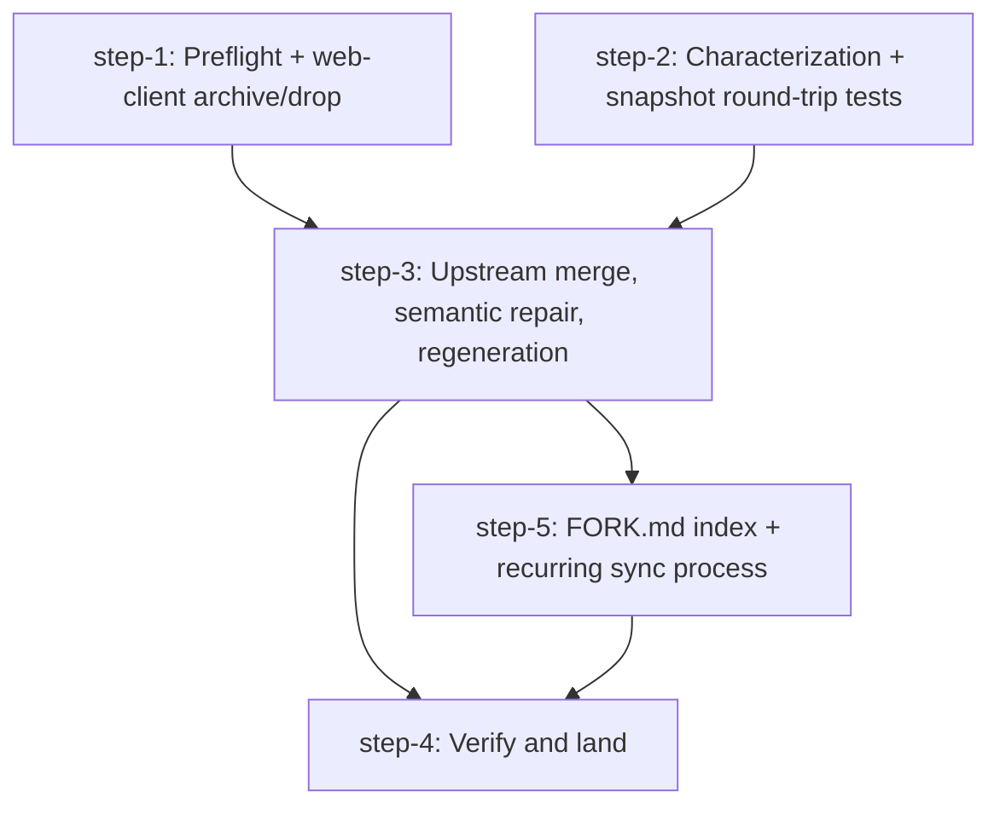

# Implementation Plan

Design: .agents/planning/2026-07-12-upstream-merge-strategy/design/detailed-design.md
Created: 2026-07-13
Tasks: 5

## Metadata
- ship: per-step

## Dependency Graph

step-1 and step-2 run in parallel: step-2's tests use only the constructive `Workspace::test_new()` corpus, so they share no inputs with step-1. The real pre-merge corpus that step-1 captures is consumed in step-3, where it is asserted against the merged build (the only place that assertion is meaningful). step-4 depends on both step-3 and step-5: step-4's fast-forward is the single landing event for the whole `merge` branch, so the FORK.md teeth and sync-loop enforcement (step-5) must be committed on `merge` before the FF captures them. Otherwise the recurring-sync enforcement never reaches `main`.

Scope note: this plan covers design Phase A (catch-up merge) and Phase C (recurring sync + FORK.md). Phase B (upstream PRs, follow-up DROPs beyond the merge-time duplicates) is deliberate follow-up work gated by the external-contributor guardrail, per the design's Scope (Out) section. It is deferred, not forgotten. The optional scheduled GitHub Action sync-nudge goes with Phase B, since the merge itself stays manual either way.

Branch note: "ship: per-step" governs review granularity only. All steps commit on the `merge` branch; `main` does not advance until step-4's fast-forward, preserving the design's recovery anchor (reset to a1804a8) throughout.

## Acknowledged Tradeoffs

- The upstream merge target SHA is not named in this plan; upstream `master` advances daily, so step-3 requires recording the pinned, reviewed SHA at merge time rather than baking a stale one in here.
- The feature-port criterion in step-3 (present OR deferred with parked tests) is deliberately satisfiable either way: deferral is the design's sanctioned policy for keybind/tab/sidebar feature ports, and step-5's deferred-debt ratchet, not step-3, is the mechanism that guarantees deferrals eventually land. The design's "MANDATORY port" wording applies with full force only to the correctness/security ports, which step-3 makes non-deferrable.
- step-2's final green re-run happens on top of step-1's post-drop commit (a soft join disclosed in the step text) even though the graph shows no edge; the tests themselves are authorable independently, so the graph models authoring parallelism and the step text models the integration point.

## Rejected Feedback

- "step-3 is too large for a single review/ship unit; split into merge-committed / repair-to-green / regen sub-steps" (devils-advocate). Rejected: the merge-to-green unit is atomic. A merged-but-unrepaired tree does not compile, so any split produces intermediate steps that violate this plan's own "working, testable increment" rule. The POC (research/04) executed the entire unit in one working session, so it fits a single implementation pass. Review burden is handled by the criterion-level evidence artifacts (review notes, test gates) rather than by splitting.

## Tasks

### step-1: Preflight gate and web-client archive/drop

- **Objective:** The merge branch starts from current `main` (a1804a8) with all preconditions confirmed and the web client archived and cleanly removed.
- **Acceptance criteria:**
  - [ ] Container image confirmed to provide Rust 1.96.1 (upstream's pin) before any merge work begins
  - [ ] Live snapshot directory backed up; a corpus of real pre-merge session snapshots captured for step-3's merged-build restore check; a snapshot format-version field confirmed to exist, or introduced if absent (the design's falsifiable round-trip test assumes it as a precondition)
  - [ ] Annotated tag and branch `archive/web-client` exist at the pre-drop commit, with build status recorded in the tag message; BOTH stay local-only (the archive carries trust-proxy, an auth-delegation surface that must not leak to the remote)
  - [ ] Web client fully removed from the working branch: `src/web/`, `web-assets/`, `src/cli/web.rs` + CLI wiring, the `web` feature and its Cargo.toml deps, web wiring in `main.rs`/`headless.rs`/`client_transport.rs`, web schema surface in `src/api/schema/server.rs`, `tests/web_client.rs`, the web-test default in `scripts/test-host.sh`, `scripts/herdr-tunnel`*, and `swap-restart.sh` web-specific handling
  - [ ] Container `cargo check --locked` passes on the post-drop tree (no dangling `use crate::web::…` or `Method::WebStart` references)
  - [ ] Working branch is based on a1804a8 (current `main`), not the 3e93d5f measurement point
- **Dependencies:** none (can start immediately)
- **Affected areas:** `src/web/`, `web-assets/`, `src/cli/`, `src/api/schema/`, `src/server/`, `src/remote/`, `Cargo.toml`, `tests/`, `scripts/`

### step-2: Characterization and snapshot round-trip tests

- **Objective:** Every runtime-authority re-target surface and every fork persisted field is pinned by tests that pass on the pre-merge tree and become the gate the semantic repair is verified against.
- **Acceptance criteria:**
  - [ ] Tests built on `AppState::test_new()` (no PTYs) pin the current `AppState` effects of: modal `ModeAction` dispatch, alt shortcuts (`MoveTabLeft/Right`, `ResizeGrow/Shrink`), `break_pane_to_tab`, tab context-menu actions, and floating/stacked pane focus
  - [ ] Stack-member inner-content geometry is pinned via the computed inner rect (pure `compute_view()` logic, expressible on both the pre-merge and merged trees). The one real semantic regression the POC hit was border-stripping on exactly this surface; the pin is phrased representation-independently because upstream's `borders` model only exists post-merge
  - [ ] Adversarial identity-state invariants asserted: `AppState::assert_invariants_for_test()` / `Workspace::assert_invariants_for_test()` run against `test_with_adversarial_identity_state()` / `test_adversarial_identity_state()` state (this merge is refactor-risk on workspace/tab/pane identity per the repo's testing convention)
  - [ ] Snapshot round-trip test asserts field-by-field equality of the fork's persisted fields (stack, floating, sidebar-ratio) against checked-in expected fixtures; a constructive corpus from `Workspace::test_new()` ensures every fork persisted field appears set in some fixture
  - [ ] All new tests pass via the container test gate on the tree step-3 merges from: the tests touch no web surface (pinned surfaces are modal/tab/sidebar/pane/snapshot), so they are drop-invariant, but they must be re-run green on top of step-1's post-drop commit before step-3 consumes them
- **Dependencies:** none (parallel with step-1; the final green re-run happens when both land, before step-3)
- **Affected areas:** `src/app/` test modules, `src/persist/` test modules, `tests/`

### step-3: Upstream merge, semantic repair, and regeneration

- **Objective:** `upstream/master` (pinned, reviewed SHA) is merged into the branch, fork features are re-targeted at upstream's runtime adapters, all generated artifacts are consistent, and the full container test suite is green.
- **Acceptance criteria:**
  - [ ] `rerere.enabled=true` and `merge.conflictStyle=zdiff3` configured; upstream remote URL verified and the reviewed SHA pinned as the merge target; the POC's rerere recordings (worktree `../herdr-merge-poc`, merge 639aef7) confirmed reachable from this worktree's git common dir before merging, or the "resolutions replay" assumption is explicitly abandoned
  - [ ] Pre-merge extraction done: env scrub (`src/env.rs`) and ANSI perf (`src/protocol/render_ansi.rs`) extracted as standalone commits or confirmed cleanly separable
  - [ ] Merge committed with zero conflict markers; every rerere auto-resolution touching a hot or trust-boundary file (`keybinds.rs`, `model.rs`, `app/input/*`, `app/mod.rs`, `tabs.rs`, `sidebar.rs`, `render_ansi.rs`, `headless.rs`, `remote/unix.rs`, `env.rs`) human-reviewed before building, with a review note recorded per file; the four a1804a8-touched sidebar-family files re-resolved by hand
  - [ ] Duplicates resolved per design: fork 98c810a yields to upstream 5449025; tab-refresh fixes ad46cf0 AND e713a0a dropped only after a preservation check confirms upstream's layout events (010afe5, 974a481, 15cab96) refresh the tab bar where they did
  - [ ] Correctness/security ports LAND pre-green (not deferrable): 2b99ced + b7015f1 (render_ansi ordering and undercurl SGR cache key; styles leak otherwise), 26db26e rebase + 9c45342 explicit-session-socket preservation surviving the scrub (env-scrub security boundary; scrub covers all spawn sites). ed31632's `remote_image_paste` config field also lands (a plain config port the POC already did outright, required here because deferring an already-done port would be waste, not because it is a correctness fix)
  - [ ] Feature ports are present or recorded as `TODO(upstream-merge)` deferrals with parked `#[cfg(any())]` tests: 088922d/b708f85 (keybinds), bc764c8/b44ca3b (tabs, via `src/ui/text.rs` helpers), 552aa8c/0cd0b1a numbering + f54d8e8 hidden mode (sidebar); 32e3d7b (help ranges) merged live per the POC, so its stale model.rs deferral TODO is trimmed, not carried
  - [ ] Ungated-method equivalence tests exist and pass: for each upstream `#[cfg(test)]` method the fork ungates (`switch_tab`, `previous_tab`, `focus_agent_entry`, `navigate_pane`, `close_active_tab`), the direct-mutation call and its `runtime_*` adapter produce identical `AppState` effects
  - [ ] Regeneration complete: `Cargo.lock` re-resolved in-container; `herdr-api.schema.json` regenerated (fork stack schema visible); vendored libghostty-vt patch index reverse-applies against the merged tree
  - [ ] `PROTOCOL_VERSION` bumped 16→17 and `tests/support/mod.rs` `CURRENT_PROTOCOL` updated; a wire-surface fingerprint test fails when the serialized schema changes without a matching bump
  - [ ] `SNAPSHOT_VERSION` collision defused: the fork sits at 4 (Stack) while upstream sits at 3, so upstream's next breaking bump would produce a semantically different "version 4". Advance the fork's `SNAPSHOT_VERSION` past upstream's counter line and add a snapshot-schema fingerprint test (analogous to the wire one) so an unbumped snapshot-shape change is a red build
  - [ ] CRITICAL gate (design finding 1): the real pre-merge snapshot corpus captured in step-1 restores cleanly through the MERGED build, or an explicit versioned migration handles it. This is the guard against silent session-state loss
  - [ ] Step-2 characterization and snapshot tests pass with asserted `AppState` effects unchanged; call-site structural adaptation (e.g. invoking the `runtime_*` adapter instead of the direct method) is allowed when documented, changing asserted outcomes is not
  - [ ] "Fully green" is judged with the documented container `/dev/ptmx` quirk in mind (the live-handoff fd-count test accepts both resolutions per scripts/test-host.sh); that known environment adaptation is not a regression
  - [ ] Focused security review pass over incoming process-spawn / socket / auth / plugin-execution diffs recorded
  - [ ] A consolidated semantic-repair record exists (per-surface summary of what was re-targeted, ported, deferred: the artifact a reviewer of this step actually reads, extending the POC's ledger format in research/04)
  - [ ] Post-merge divergence baseline recorded (fork-ahead count and merge-base diff shortstat) as the reference the recurring sync's shrink metric measures against (feeds step-5)
  - [ ] Container `just test` (scripts/test-host.sh) fully green
- **Dependencies:** step-1, step-2 (waits for both)
- **Affected areas:** repo-wide merge; concentrated in `src/config/`, `src/app/`, `src/ui/`, `src/protocol/`, `src/remote/`, `src/server/`, `src/persist/`, `src/api/schema/`, `vendor/`, `Cargo.lock`, `tests/`

### step-4: Verify against live-adjacent conditions and land

- **Objective:** The merged build is verified beyond the automated suite (second instance, visual smoke, rehearsed rollback) and `main` is fast-forwarded and pushed.
- **Acceptance criteria:**
  - [ ] Automatable smoke checks live in nextest: nested-session guard, modal dispatch + Locked-mode input rejection, tab-bar narrow-width batching without panic
  - [ ] A second instance runs on a separate socket using a container-built binary (never the live server); each irreducibly-visual smoke item passes its stated condition: hint bar reflects active mode; sidebar badges/dots/rail render; floating pane drags above tiled; stacked pane focus expands
  - [ ] The staged prior-binary revert path is dry-run once (rehearsed, not theoretical)
  - [ ] `main` fast-forwarded to the merge branch head (which includes step-5's FORK.md and enforcement commits) and pushed to origin with no force-push; live swap deferred until explicit user request
  - [ ] Post-ff wave-branch sweep recorded: branches with unpushed work listed, those touching `app/input/`, `actions.rs`, `state.rs` flagged for the migration recipe
- **Dependencies:** step-3, step-5 (the fast-forward is the single landing event; step-5's commits must be on `merge` before it)
- **Affected areas:** `tests/`, `scripts/`, git refs (`main`, `origin/main`), local worktree inventory

### step-5: FORK.md index with enforcement teeth and recurring sync process

- **Objective:** Every standing fork patch is tracked in a machine-checked index and the per-release sync loop is documented well enough to run without rediscovery.
- **Acceptance criteria:**
  - [ ] `FORK.md` exists at the repo root with one entry per KEEP patch and per deferral, following the design's entry schema (why, upstream ref, touched files, removal condition, removal-condition commit, migration note, last re-checked); the modal-keybind entry is labeled permanent (`removal condition commit: none (permanent)`); a web-client revival note records the archive tag and the rebase-before-runtime-authority requirement
  - [ ] A maintenance test wired into `just check` fails when a listed touched file no longer exists or an entry's removal-condition commit is an ancestor of `upstream/master`; these git-dependent checks hard-fail with a "fetch upstream first" message when `upstream/master` is absent or stale, never skip
  - [ ] Deferred-debt ratchet in the same maintenance test: fails if the count of `TODO(upstream-merge)` markers or `#[cfg(any())]`-parked tests rises release-over-release; the baseline counts are persisted in-repo (seeded from the post-merge ledger) so the first comparison is defined; every parked test has a FORK.md deferral entry
  - [ ] The recurring sync process is documented with: per-release cadence and missed-sync fallback, exact commands, divergence alert on behind-count exceeding ~100 commits, the human-review file list for rerere replays, the same verification gate as Phase A, per-sync snapshot backup and subprocess-scrub audit, the post-ff wave-branch migration note, and the step-3 post-merge divergence baseline recorded as the shrink-metric reference
  - [ ] The direct-mutation → `runtime_*` migration recipe for wave branches is recorded
- **Dependencies:** step-3 (needs the final deferral ledger; completes before step-4's fast-forward so the enforcement lands with the merge)
- **Affected areas:** `FORK.md` (new), `scripts/` maintenance tests, `justfile` wiring, fork process docs
