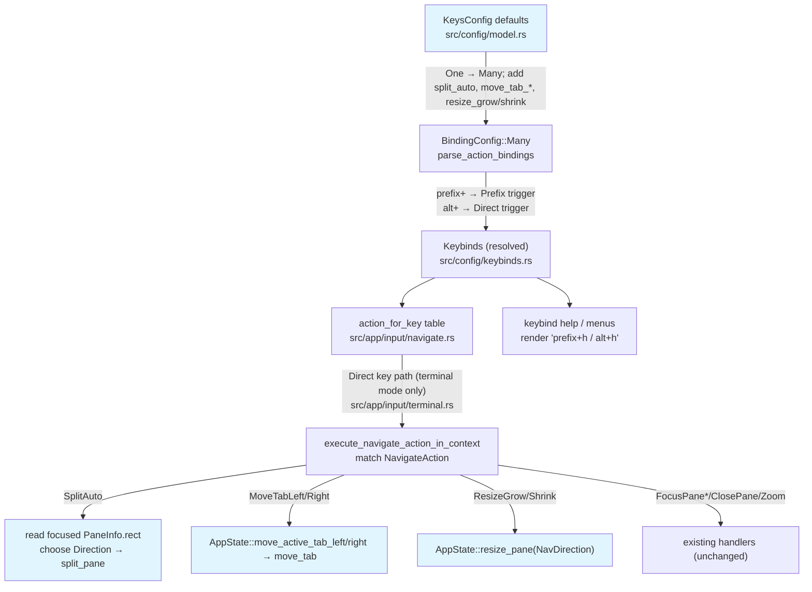

# Alt Shortcuts (Zellij Feature 1) — Detailed Design

## Overview

Add direct `Alt+key` keybindings to herdr that work without entering prefix mode, mirroring Zellij's "shared mode" ergonomics. This is the #1 ergonomic win over herdr's tmux-style prefix model.

The infrastructure already exists: `BindingTrigger::Direct` for non-prefix bindings, `BindingConfig::Many` for multiple bindings per action, and an Alt-modifier parser that handles both Kitty and legacy ESC-prefixed encodings. This wave adds **default** Alt bindings *alongside* the existing prefix bindings (not replacing them) and introduces two small new actions.

This is a LOW-effort, config-and-dispatch change. No architectural change to the layout tree, mode system, or input pipeline.

### Authority and divergence from raw Zellij

The user directive is "research Zellij, do the same." We researched Zellij's actual defaults (`zellij-utils/assets/config/default.kdl`, `main` branch) rather than relying on the rough-idea table, which was inaccurate. Where faithful mirroring collides with herdr's current capabilities, the user made three explicit scoping decisions (recorded in `idea-honing.md`):

1. **Alt+h/j/k/l = plain directional pane focus** (not Zellij's `MoveFocusOrTab` edge-fallback). Simpler; no new focus logic.
2. **Alt+= / Alt+- = direct fixed-step resize, faithful to Zellij** (revised after critique). Alt+= grows the focused pane, Alt+- shrinks it, by 5%, with no mode entry. herdr already exposes the primitive (`AppState::resize_pane(NavDirection)` → `resize_focused(dir, 0.05, area)`, and `0.05` equals Zellij's `RESIZE_PERCENT = 5.0`).
3. **Binding set = Zellij-faithful subset + herdr extras.** Bind the Zellij defaults herdr can do, add `Alt+x`/`Alt+z` (herdr extras), and skip Zellij defaults herdr lacks (swap layouts, floating panes, pane groups).

### Behavioral scope: direct Alt bindings are terminal-mode-only

Direct (non-prefix) bindings are dispatched only from `prepare_terminal_key_forward` (`src/app/input/terminal.rs:37`), i.e. when the app is in `Mode::Terminal`. They do **not** fire while the user is parked in Navigate or Prefix mode. This satisfies the wave's goal (R1–R6: work without entering prefix mode) for the everyday terminal-mode case, but it is a divergence from Zellij's cross-mode "shared" bindings. Accepted for this wave; recorded in Appendix B and not wired into the navigate-mode handler.

### Interception is unconditional and silent

When a direct Alt binding matches in terminal mode, `prepare_terminal_key_forward` returns `None` and the key **never reaches the focused pane** — there is no mode/alt-screen gating. So after this change herdr globally and silently intercepts `Alt+h/j/k/l/n/x/z/i/o`, `Alt+=`, `Alt+-` by default; a focused vim/readline/agent app will not receive them. This is the central user-facing risk (N6 below). The only remedy is config removal. `Alt+h/j/k/l` (focus) is the high-value, low-collision win; `Alt+n/i/o/x/z` carry higher collision risk with in-pane apps.

## Detailed Requirements

### Functional

| # | Requirement |
|---|-------------|
| R1 | `Alt+h/j/k/l` focus the pane to the left/down/up/right of the focused pane, without prefix entry. |
| R2 | `Alt+n` opens a new pane, choosing split direction automatically from the focused pane's aspect ratio (`split_auto`). |
| R3 | `Alt+x` closes the focused pane. |
| R4 | `Alt+z` toggles zoom on the focused pane. |
| R5 | `Alt+=` grows and `Alt+-` shrinks the focused pane by a fixed 5% step (direct, no mode entry). |
| R6 | `Alt+i` / `Alt+o` move (reorder) the current tab left / right. |
| R7 | All existing `prefix+*` bindings for these actions continue to work unchanged. |
| R8 | Every Alt binding is user-overridable; setting an action to a single string (or omitting the alt entry) removes the Alt binding. |

### Non-functional

| # | Requirement |
|---|-------------|
| N1 | Existing single-string user configs must still parse (they resolve to `BindingConfig::One`). |
| N2 | The default config TOML export emits arrays for the dual-bound actions; the round-trip must be lossless. |
| N3 | Alt key decoding must work under both the Kitty keyboard protocol and legacy ESC-prefixed Alt encoding. |
| N4 | No conflict-detection false positives: modified direct keys (Alt+x, etc.) must pass the "unsafe unmodified printable" guard. Default config must produce **zero** conflict diagnostics (no rejected duplicate combos). |
| N5 | The keybind help screen (`prefix+?`) and any mode hint UI render the new Alt bindings alongside the prefix bindings (`"prefix+h / alt+h"`). |
| N6 | Document that direct Alt bindings unconditionally and silently shadow the focused pane's app in terminal mode, and that they are terminal-mode-only. All bindings are configurable/removable. |

### Explicitly out of scope (deferred)

- `Alt+[` / `Alt+]` swap-layout cycling (no swap-layout engine in herdr yet — later wave).
- `Alt+f` floating panes, `Alt+p` pane groups (features herdr does not have).
- Zellij's `MoveFocusOrTab` edge-fallback semantics.
- Wiring direct Alt bindings into Navigate / Prefix mode handlers (terminal-mode-only this wave).
- Any change to the legacy `Alt+[`/`Alt+]` CSI-collision parsing risk (deferred with swap layouts).

## Architecture Overview

The change touches four layers of the existing keybinding pipeline. No new modules.



`split_auto`, `move_tab_left`, `move_tab_right`, `resize_grow`, `resize_shrink` are Alt-only new actions; `focus_pane_*`, `close_pane`, `zoom` gain an Alt variant alongside their existing prefix binding. `resize_mode` (`prefix+r`) is unchanged.

### Data flow for a direct Alt key (e.g. `Alt+n`)

```mermaid
sequenceDiagram
    participant TTY as raw_input.rs (framing)
    participant P as input/parse.rs
    participant T as input/terminal.rs
    participant N as navigate.rs
    participant S as AppState

    TTY->>P: byte sequence (Kitty \x1b[110;3u OR legacy \x1b n)
    P->>T: TerminalKey { Char('n'), ALT }
    T->>N: terminal_direct_navigation_action(key)
    N->>N: action_for_key(key, Direct) → matches kb.split_auto
    N->>N: execute_navigate_action_in_context(SplitAuto, Direct)
    N->>S: read focused PaneInfo.rect → choose Direction
    N->>S: state.split_pane(rt, direction)
```

## Components and Interfaces

### Component 1: Config defaults (`src/config/model.rs`)

`KeysConfig` (model.rs:295-408) and its `Default` impl (model.rs:557-616).

**Change existing fields from `One` to `Many`** (add the Alt variant alongside the current prefix binding):

| Field | Current default | New default |
|-------|-----------------|-------------|
| `focus_pane_left` | `one("prefix+h")` | `Many(["prefix+h", "alt+h"])` |
| `focus_pane_down` | `one("prefix+j")` | `Many(["prefix+j", "alt+j"])` |
| `focus_pane_up` | `one("prefix+k")` | `Many(["prefix+k", "alt+k"])` |
| `focus_pane_right` | `one("prefix+l")` | `Many(["prefix+l", "alt+l"])` |
| `close_pane` | `one("prefix+x")` | `Many(["prefix+x", "alt+x"])` |
| `zoom` | `one("prefix+z")` | `Many(["prefix+z", "alt+z"])` |
| `resize_mode` | `one("prefix+r")` | **unchanged** (`one("prefix+r")`) |

**Add new fields** to `KeysConfig` (all Alt-only):

```rust
#[serde(default)]
pub split_auto: BindingConfig,
#[serde(default)]
pub move_tab_left: BindingConfig,
#[serde(default)]
pub move_tab_right: BindingConfig,
#[serde(default)]
pub resize_grow: BindingConfig,
#[serde(default)]
pub resize_shrink: BindingConfig,
```

New defaults (set explicitly in `impl Default for KeysConfig`):

| Field | Default |
|-------|---------|
| `split_auto` | `one("alt+n")` |
| `move_tab_left` | `one("alt+i")` |
| `move_tab_right` | `one("alt+o")` |
| `resize_grow` | `one("alt+=")` |
| `resize_shrink` | `one("alt+-")` |

**`split_auto` is Alt-only (no prefix companion) — decided.** Zellij's `Alt+n` is auto-direction new pane. herdr already has `split_vertical` (`prefix+v`) and `split_horizontal` (`prefix+minus`), which are the natural prefix-mode split workflow; adding a redundant prefix key for auto-split would clutter the prefix namespace. Note `prefix+c` is **already bound to `new_tab`** (model.rs:585) and must not be reused. Consequence: `split_auto` is the only action in this set with no prefix fallback, so a user whose terminal eats `Alt+n` (nested multiplexer) can still split manually via `prefix+v` / `prefix+minus` and pick the direction themselves — auto-direction is a convenience, not load-bearing. Same applies to `move_tab_*`, `resize_grow`, `resize_shrink` (Alt-only); the prefix-mode fallbacks are `resize_mode` (`prefix+r`) for resizing and there is no prefix tab-reorder (acceptable — tab reorder is also available via mouse drag).

`#[serde(default)]` ensures old configs without these fields deserialize fine (N1). Be careful: `BindingConfig::default()` is `One(String::new())` (empty). The populated defaults above MUST be set in `impl Default for KeysConfig`; the `#[serde(default)]` attribute only governs *missing-field* deserialization (where empty-string-as-unbound is the correct, harmless behavior — an absent field means the user has no binding for that new action, which is fine).

### Component 2: Resolved keybinds (`src/config/keybinds.rs`)

`Keybinds` struct (keybinds.rs:261-310) and the `action!`-macro literal in `validated_keybinds` (keybinds.rs:405-496).

Add five resolved fields:

```rust
// in struct Keybinds
pub split_auto: ActionKeybinds,
pub move_tab_left: ActionKeybinds,
pub move_tab_right: ActionKeybinds,
pub resize_grow: ActionKeybinds,
pub resize_shrink: ActionKeybinds,

// in the Keybinds { ... } literal
split_auto:     action!("keys.split_auto",     &self.keys.split_auto),
move_tab_left:  action!("keys.move_tab_left",  &self.keys.move_tab_left),
move_tab_right: action!("keys.move_tab_right", &self.keys.move_tab_right),
resize_grow:    action!("keys.resize_grow",    &self.keys.resize_grow),
resize_shrink:  action!("keys.resize_shrink",  &self.keys.resize_shrink),
```

No changes to `parse_action_bindings`, `BindingTrigger`, `BindingRegistry`, or `reject_binding` — `Many` resolution, the prefix-vs-direct split, conflict detection, and the unmodified-printable guard all already handle this. Alt-modified direct keys pass the guard (N4); verified: `is_unmodified_printable` (keybinds.rs:1198-1201) only rejects when `combo.1.difference(SHIFT).is_empty()`, and ALT makes that non-empty.

**Conflict-resolution note (corrected):** `BindingRegistry` resolves conflicts by **registration order within the `validated_keybinds` function body** (first-writer-wins, keybinds.rs:330-373) — *not* struct field declaration order. The devil's-advocate verified there are **zero** existing ALT-modifier default bindings anywhere in herdr's keymap; the only `h/j/k/l` direct defaults are navigate-mode-scoped *bare* keys (a different combo from `(Char('h'), ALT)`). So the proposed Alt set has no internal collision. This is guarded permanently by an N4 invariant test (`default_config_has_no_conflict_diagnostics`), not just a one-time audit — see Testing.

### Component 3: Actions (`src/app/input/navigate.rs`)

`NavigateAction` enum (navigate.rs:568-615). Add:

```rust
SplitAuto,
MoveTabLeft,
MoveTabRight,
ResizeGrow,
ResizeShrink,
```

The dispatch match (`execute_navigate_action_in_context`) is exhaustive, so the compiler enforces that arms exist for the new variants.

`action_for_key` table (navigate.rs:664-726). Add entries:

```rust
(&kb.split_auto,     NavigateAction::SplitAuto),
(&kb.move_tab_left,  NavigateAction::MoveTabLeft),
(&kb.move_tab_right, NavigateAction::MoveTabRight),
(&kb.resize_grow,    NavigateAction::ResizeGrow),
(&kb.resize_shrink,  NavigateAction::ResizeShrink),
```

### Component 4: Dispatch (`src/app/input/navigate.rs`)

`execute_navigate_action_in_context` match (navigate.rs:753-953). Add three arms.

**`SplitAuto`:**

```rust
NavigateAction::SplitAuto => {
    let direction = state.auto_split_direction();
    state.split_pane(terminal_runtimes, direction);
    leave_navigate_mode(state);
}
```

New helper `AppState::auto_split_direction(&self) -> Direction` (`Direction` is the re-exported `ratatui::layout::Direction`, per layout.rs:5):

```rust
// Mirror Zellij's "split along the longer (cell-corrected) dimension".
// herdr cells are ~2:1 tall→wide; the threshold of 1.5 is the agreed
// approximation. Mapping verified against split_rect (layout.rs:612-631):
//   Direction::Horizontal => splits along WIDTH  => two columns (side-by-side)
//   Direction::Vertical   => splits along HEIGHT => two rows (stacked)
fn auto_split_direction(&self) -> Direction {
    let (w, h) = self.focused_pane_rect().unwrap_or((0, 0)); // (width, height) in cells
    if (w as f32) > (h as f32) * 1.5 {
        Direction::Horizontal  // wide pane -> side-by-side (two columns)
    } else {
        Direction::Vertical    // tall/square pane -> stacked (two rows)
    }
}
```

**New helper `AppState::focused_pane_rect(&self) -> Option<(u16, u16)>` — return order is `(width, height)`.** It reads `state.active` → workspace → `Workspace::focused_pane_id` → `AppState::pane_info_by_id` (mouse.rs:1289) → `PaneInfo.rect` (layout.rs:31-41) and returns `(rect.width, rect.height)`. **Do NOT reuse `AppState::estimate_pane_size()`** (state.rs:1501-1507): it returns `(height, width)` — the *opposite* order — and reads the *first* pane, not the focused one. The plan must add this as an explicit helper with a doc comment pinning the `(width, height)` order. (`Workspace::focused_pane_id` is on `Workspace`, not `AppState`; the helper threads through the active workspace — confirm the exact accessor at workspace.rs ~1114 during implementation.)

**Empty / no-focus behavior:** `focused_pane_rect()` returns `None` → `auto_split_direction` falls back to `Direction::Vertical`. `split_pane` is no-op-safe on an empty/no-focus layout (verified: mod.rs:477-526 guards, layout.rs returns node unchanged). On a workspace that already has a single focused pane (the normal case), `split_auto` creates the second pane as intended. The one path to confirm during implementation: a workspace with **zero** panes — verify `split_pane` either creates the first pane or is a harmless no-op (auto-split's purpose is to make a pane, so a silent nothing on a truly empty workspace is acceptable but should be asserted, not assumed).

**Direction-inversion footgun (test-pinned, not a bug):** herdr's existing `split_pane` calls invert enum naming at the call site — `SplitVertical => Direction::Horizontal` (navigate.rs:897-904). The mapping in `auto_split_direction` is written against the *visual* result (verified via `split_rect`), so it is correct. Because the naming is a footgun for future readers, unit tests pin it by visual outcome: wide focused pane → two columns; tall → two rows; square → two rows.

**`ResizeGrow` / `ResizeShrink`:**

```rust
NavigateAction::ResizeGrow => {
    state.resize_focused_pane(true);   // grow focused pane 5%
}
NavigateAction::ResizeShrink => {
    state.resize_focused_pane(false);  // shrink focused pane 5%
}
```

**Axis hazard (verified bug in the naive approach — must not ship):** the obvious `state.resize_pane(NavDirection::Right)` does NOT work on a stacked layout. `resize_focused` (layout.rs:210-234) computes `target_dir` once from nav (`Left|Right → Direction::Horizontal`), and `nearest_resize_split` (layout.rs:351-363) filters splits by `s.direction == target_dir`. The `.or_else` fallback flips only the *edge* (`opposite_direction(nav)`), **not the axis** — so on a vertical-only/stacked layout (all splits `Direction::Vertical`) both the primary and fallback calls filter on `Horizontal`, find nothing, and the resize is a **silent no-op**. A headline feature that does nothing on a stacked layout is not "mirroring Zellij" (Zellij resizes regardless of layout orientation).

**Fix — try both axes.** New helper `AppState::resize_focused_pane(&mut self, grow: bool)` that resizes on the horizontal axis if the focused pane has a horizontal-neighbor split, otherwise the vertical axis. Implemented via a change-detecting resize:

```rust
fn resize_focused_pane(&mut self, grow: bool) {
    // horizontal axis first (Right/Left), then vertical (Down/Up) as a real axis fallback.
    let (h, v) = if grow {
        (NavDirection::Right, NavDirection::Down)
    } else {
        (NavDirection::Left, NavDirection::Up)
    };
    if !self.resize_pane(h) {        // resize_pane now returns `bool` = "ratios changed"
        self.resize_pane(v);
    }
}
```

**Required supporting change to `AppState::resize_pane` (actions.rs:1617-1633):** make it return `bool` (whether the split ratios actually changed) instead of `()`. The inner `TileLayout::resize_pane(pane_id, …)` already returns this bool (layout.rs:236-252, compares `split_ratios` before/after); `resize_focused` does not, so `AppState::resize_pane` should compute change the same way (snapshot `split_ratios` around the call, or call the pane-id variant for the focused pane). Also gate `mark_session_dirty()` on the change being non-zero, fixing an existing minor wart where a no-op resize still marks the session dirty. Two existing call sites use `resize_pane` in statement position and ignore any return, so the `()` → `bool` change is non-breaking (no `#[must_use]`): `handle_resize_key` (modal.rs:634-637) and the test `capture_contract_tracks_resize_ratio_changes` (src/persist/snapshot.rs:919). Grep both when implementing so `just check` isn't a surprise.

`grows` semantics confirmed (layout.rs:222): `Right`/`Down` grow, `Left`/`Up` shrink; `adj = ±0.05`, and `0.05` equals Zellij's `RESIZE_PERCENT = 5.0`. No mode entry; no `leave_navigate_mode` (these arms run only in terminal mode — `navigate_mode_action_for_key` dispatches via `BindingDispatch::Prefix`, and these Alt-only actions have no prefix binding, so they are unreachable in navigate mode; `finish_action_context` leaves `Mode::Terminal` untouched). If the focused pane has no resizable split on either axis (e.g. a single-pane tab), both calls are no-ops — correct.

**`MoveTabLeft` / `MoveTabRight`:**

```rust
NavigateAction::MoveTabLeft => {
    state.move_active_tab_left();
    leave_navigate_mode(state);
}
NavigateAction::MoveTabRight => {
    state.move_active_tab_right();
    leave_navigate_mode(state);
}
```

Two helpers `AppState::move_active_tab_left(&mut self)` / `move_active_tab_right(&mut self)` (dropping the `i32`/sign-branch puzzle the round-2 review flagged). **CRITICAL — `Workspace::move_tab` uses insert-before / pre-removal index semantics** (workspace.rs:571-594, verified): it computes `target = if source < insert { insert - 1 } else { insert }`, clamps to `len-1`, and no-ops when `source == target`. So the insert-slot for a rightward move must be `source + 2`, not `source + 1` (the latter → `target = source` → silent no-op).

Compute a clamped **target index** first, then convert to the insert slot once:

```rust
fn move_active_tab_left(&mut self) {
    let Some(ws) = self.active.and_then(|i| self.workspaces.get(i)) else { return; };
    if ws.tabs.len() < 2 || ws.active_tab == 0 { return; }
    let target = ws.active_tab - 1;
    self.move_tab(ws.active_tab, target);              // left: insert slot == target
}

fn move_active_tab_right(&mut self) {
    let Some(ws) = self.active.and_then(|i| self.workspaces.get(i)) else { return; };
    let n = ws.tabs.len();
    if n < 2 || ws.active_tab + 1 >= n { return; }
    let target = ws.active_tab + 1;
    self.move_tab(ws.active_tab, target + 1);          // right: insert slot == target + 1
}
```

(Borrow note: read `active_tab`/`tabs.len()` into locals before the `&mut self` call to `self.move_tab`.) Edge behavior is explicit guards (first tab can't go left, last can't go right), so the underlying clamp is belt-and-suspenders. Worked example `[A,B,C]`: active=0 right → `move_tab(0, 2)` → `target=1` → A lands at idx 1 (✓); active=1 left → `move_tab(1, 0)` → `target=0` → B lands at idx 0 (✓). Confirm `ws.active_tab`/`ws.tabs` field names and `AppState::move_tab` signature during implementation (verified present: actions.rs:1241, workspace.rs:571). The `MoveTabLeft`/`MoveTabRight` dispatch arms call these two helpers. Tests MUST include a **mid-list rightward success** (active=0 of 3 → MoveTabRight → lands at idx 1), not only the no-op edge cases, since the off-by-one bug would also "pass" the edge no-op tests.

### Component 5: Help / menu rendering (`src/ui/keybind_help.rs`, `src/ui/menus.rs`)

`ActionKeybinds::label()` already joins `Many` as `"prefix+h / alt+h"` (keybinds.rs:184-218), so existing entries auto-update. Add help entries for the new actions in the panes/tabs groups:

```rust
help_entry(keybind_label(&kb.split_auto),    "new pane (auto split)")
help_entry(keybind_label(&kb.move_tab_left),  "move tab left")
help_entry(keybind_label(&kb.move_tab_right), "move tab right")
help_entry(keybind_label(&kb.resize_grow),    "grow pane")
help_entry(keybind_label(&kb.resize_shrink),  "shrink pane")
```

`keybind_help_groups` is pure and PTY-free, so a test can assert these labels render (N5).

### Component 6: Raw input / parser — NO CHANGES

Confirmed by research: `parse_key_combo` handles `alt+h/j/k/l/n/x/z/i/o`, `alt+=`, `alt+-`. Both Kitty (`\x1b[<cp>;3u`) and legacy (`\x1b<char>`) decode to `KeyModifiers::ALT`. The only ambiguous case is `alt+[`/`alt+]` (legacy CSI collision), which we are **not** binding. No edits to `src/raw_input.rs` or `src/input/parse.rs`.

## Data Models

No new persistent data structures. The only model changes are additive fields:

- `KeysConfig` (config model): `+5 BindingConfig` fields (`split_auto`, `move_tab_left`, `move_tab_right`, `resize_grow`, `resize_shrink`); 6 existing fields change default value `One → Many` (`focus_pane_left/down/up/right`, `close_pane`, `zoom`). `resize_mode` unchanged.
- `Keybinds` (resolved): `+5 ActionKeybinds` fields.
- `NavigateAction` (enum): `+5` variants (`SplitAuto`, `MoveTabLeft`, `MoveTabRight`, `ResizeGrow`, `ResizeShrink`).

No protocol/wire change (`PROTOCOL_VERSION` untouched). No persisted-state migration — config defaults are computed at load, and `#[serde(default)]` covers absent fields.

## Error Handling

| Condition | Handling |
|-----------|----------|
| User config sets an action to a single string | Parses as `BindingConfig::One`; Alt binding simply absent (R8, N1). |
| User config omits a new action field entirely | `#[serde(default)]` → `One("")` (unbound); harmless, no binding registered. |
| User binds `alt+x` to two different actions | Existing `reject_binding` dedup fires; second registration rejected and logged via `tracing`, as today. No panic. |
| `split_auto` with no focused pane / empty layout | `focused_pane_rect()` → `None` → `auto_split_direction` returns `Direction::Vertical`; `split_pane` is no-op-safe on empty/no-focus layouts (verified mod.rs:477-526). |
| `resize_grow`/`resize_shrink` with no resizable split on either axis | `resize_focused_pane` tries horizontal then vertical; if neither changes ratios (single-pane tab) → no-op, no error. |
| `resize_grow`/`resize_shrink` on a stacked (vertical-only) layout | Horizontal resize returns `false` (no horizontal split) → helper falls back to vertical-axis resize → ratios change. (Naive single-axis resize would silently no-op here — see Component 4 axis hazard.) |
| `move_active_tab_*` at first tab moving left / last moving right | Explicit guard → no-op (belt-and-suspenders with `Workspace::move_tab`'s `source == target` no-op). No error surfaced. |
| `move_active_tab_*` with <2 tabs | Helper early-returns; no-op. |
| `Alt+x` (close pane) fired while a pane app expects it | **Destructive + silent**: closes the focused pane and its PTY with no undo, and the key never reaches the app. Higher-risk than the focus keys; called out specifically in docs (Appendix D). User can remove the `alt+x` binding. |
| Alt key consumed by outer multiplexer (nested tmux/screen) | Out of herdr's control; documented as a known limitation. User can rely on prefix bindings (or `prefix+v`/`prefix+minus`/`prefix+r` for the Alt-only actions). |
| Alt key in terminal mode while a pane app wants it (vim/readline) | Interception is **unconditional and silent** — the key never reaches the focused app (terminal.rs:37-56 returns `None`). Documented limitation (N6); user removes the Alt binding to restore pass-through. |
| User parked in Navigate/Prefix mode presses an Alt key | Direct bindings are terminal-mode-only; the Alt key does not trigger the action in these modes. Documented (Appendix B). |

## Testing Strategy

Per CLAUDE.md: unit tests next to code, `AppState::test_new()` / `Workspace::test_new()` without PTYs. This change touches config/keybind resolution and pane/tab identity-adjacent dispatch — treat as **moderate refactor-risk** (touches keybind config surface + tab reorder). Add focused characterization + unit tests; do not add full-screen agent fixtures.

### Config / keybind resolution (PTY-free)
- `default_config_binds_alt_keys`: build default `Keybinds`; assert `focus_pane_left` resolves to both a `Prefix(h)` and `Direct((Char('h'), ALT))` trigger; same for j/k/l, close_pane, zoom.
- `resize_mode_unchanged`: assert `resize_mode` still resolves to only `Prefix(r)` (no Alt added).
- `resize_grow_shrink_bind_alt_eq_minus`: assert `resize_grow` resolves to `Direct((Char('='), ALT))` and `resize_shrink` to `Direct((Char('-'), ALT))`.
- `split_auto_default_binds_alt_n`: assert `split_auto` resolves to `Direct((Char('n'), ALT))`.
- `move_tab_defaults_bind_alt_i_o`: assert `move_tab_left`/`right` resolve to `Direct(i/o, ALT)`.
- `single_string_user_config_still_parses`: deserialize a config TOML with `focus_pane_left = "prefix+h"` (string form); assert it resolves to `One` / a single Prefix trigger (N1).
- `absent_new_action_field_is_unbound`: deserialize a config TOML lacking `split_auto` etc.; assert no panic and no binding registered (N1).
- `keysconfig_toml_roundtrip_lossless`: serialize default `KeysConfig`, re-deserialize, assert equal; assert the `Many` fields emit arrays and `alt+=` survives the round-trip (N2).
- `default_config_has_no_conflict_diagnostics`: build default `Keybinds` and inspect `collect_diagnostics`/conflict output; assert **zero** rejected duplicate combos. Permanent N4 invariant (not a one-time audit).
- `parse_alt_symbol_keys`: assert `parse_key_combo("alt+=")`, `("alt+-")` produce `(Char('='/'-'), ALT)` (N3, config-string parser level).

### Byte-decoder tests (N3, the wire half — `src/input/parse.rs`)
- `decode_alt_n_kitty_and_legacy`: feed `\x1b[110;3u` (Kitty) and `\x1b n` (legacy); assert both decode to `(Char('n'), ALT)`.
- `decode_alt_equals_kitty_and_legacy`: feed `\x1b[61;3u` and `\x1b =`; assert both decode to `(Char('='), ALT)`. (Confirms the one combo with no named alias decodes on the wire, not just in the config parser.)

### Pure-helper / direction tests (PTY-free — test the helper, NOT full dispatch)
The `SplitAuto` *dispatch* arm calls `split_pane` → `Tab::split_focused` → `TerminalRuntime::spawn`, which spawns a real PTY. So tests target the **pure `auto_split_direction()` helper** and the PTY-free `Workspace::test_split` seam, never the full direct-key dispatch.

**Test-setup dependency (critical):** `auto_split_direction`/`focused_pane_rect`/`resize_focused_pane` all read geometry from `state.view.pane_infos`, which `AppState::test_new()` initializes **empty** (state.rs:1668). A test that skips seeding it gets `None`/no-op and a **false pass**. Each geometry test MUST first seed `view.pane_infos` from the layout, the way existing tests do at `src/app/input/mouse.rs:1742` (compute `layout.panes(area)` for the active tab and assign into `state.view.pane_infos`). Name this step explicitly in every geometry test.

- `auto_split_wide_pane_is_horizontal`: seed a focused pane rect 100×20 → `auto_split_direction()` returns `Direction::Horizontal` (→ two columns). Pins the inversion mapping by enum.
- `auto_split_tall_pane_is_vertical`: focused rect 40×60 → returns `Direction::Vertical` (→ two rows).
- `auto_split_square_pane_is_vertical`: square rect → returns `Direction::Vertical` (stacked) — pins the documented square default.
- `auto_split_no_focus_defaults_vertical`: empty `view.pane_infos` → `focused_pane_rect()` returns `None` → `auto_split_direction()` returns `Direction::Vertical`. Pins the no-focus fallback.
- `focused_pane_rect_returns_width_height_order`: assert the helper returns `(width, height)` (guards the tuple-order trap vs `estimate_pane_size`, which returns `(height, width)`).
- Layout outcome (optional, via PTY-free seam): use `Workspace::test_split(Direction::Horizontal)` then assert two side-by-side panes, confirming the enum→visual mapping end to end without a PTY.

### Dispatch / behavior — tab reorder (with `AppState::test_new()` / `Workspace::test_new()`, PTY-free)
- `move_tab_right_mid_list_succeeds`: **3 tabs, active = idx 0 → `MoveTabRight` lands active at idx 1.** This is the test that catches the insert-before off-by-one; the buggy `source+delta` formula would leave it at idx 0.
- `move_tab_left_reorders`: 3 tabs, active = idx 1 → `MoveTabLeft` → idx 0; identity preserved.
- `move_tab_right_at_last_tab_is_noop`: active = last → `MoveTabRight` clamps, no change, no panic.
- `move_tab_left_at_first_tab_is_noop`: active = 0 → `MoveTabLeft` clamps.
- `move_tab_single_tab_is_noop`: 1 tab → either direction no-ops.

### Resize behavior (PTY-free; MUST seed `view.pane_infos`)
`AppState::resize_pane`/`resize_focused_pane` are gated on `state.view.pane_infos` (the `union` of pane rects defines `area`), so these tests must seed it (see setup dependency above) — they are not "pure layout tree" calls.
- `resize_grow_side_by_side_changes_ratio`: side-by-side 2-pane layout, focused pane → `resize_focused_pane(true)` increases the split ratio ~0.05; `resize_focused_pane(false)` decreases it.
- `resize_grow_stacked_layout_changes_ratio`: **vertical-only / stacked 2-pane layout** → `resize_focused_pane(true)` still changes the ratio (via the vertical-axis fallback). This is the test that catches the axis-fallback bug; a naive horizontal-only `resize_pane(Right)` would leave the ratio unchanged here.
- `resize_single_pane_is_noop`: single-pane tab → both grow and shrink are no-ops, no panic.
- `appstate_resize_pane_returns_change_bool`: assert the `AppState::resize_pane` return is `true` when ratios change and `false` on a no-op (guards the new return type the fallback depends on).

### Help rendering (N5, PTY-free)
- `keybind_help_includes_alt_labels`: assert `keybind_help_groups` output contains `"prefix+h / alt+h"` (existing action) and `"alt+n"` / `"alt+="` / `"alt+-"` (new actions).

### Mode-scope pinning
- `alt_key_terminal_mode_only`: assert an Alt direct combo resolves to its action via `action_for_key(.., Direct)` (terminal path) but is NOT reachable via `navigate_mode_action_for_key` (which dispatches `BindingDispatch::Prefix` and these Alt-only/Direct actions have no prefix trigger). Pins the documented terminal-mode-only scope (Appendix B).

### Identity invariants
- After `move_active_tab_left/right`, call `Workspace::assert_invariants_for_test()` to confirm tab identity/active-tab consistency (CLAUDE.md identity-refactor guidance).

### Manual verification (live, per CLAUDE.md)
Build the debug binary and exercise the keys in a real session:
```bash
env -u HERDR_SOCKET_PATH -u HERDR_CLIENT_SOCKET_PATH cargo run -- ...
```
Verify Alt+h/j/k/l focus, Alt+n auto-split picks sensible direction, Alt+x/z, Alt+=/- enter resize mode, Alt+i/o reorder tabs — under both a Kitty-protocol terminal and a legacy terminal if available.

## Appendices

### Appendix A: Final binding set (decision of record)

| Shortcut | herdr action | New action? | Default `BindingConfig` |
|----------|--------------|-------------|-------------------------|
| `Alt+h/j/k/l` | FocusPane L/D/U/R | no | `Many([prefix+h.., alt+h..])` |
| `Alt+n` | SplitAuto | **yes** | `One("alt+n")` |
| `Alt+x` | ClosePane | no | `Many(["prefix+x","alt+x"])` |
| `Alt+z` | Zoom | no | `Many(["prefix+z","alt+z"])` |
| `Alt+=` | ResizeGrow | **yes** | `One("alt+=")` |
| `Alt+-` | ResizeShrink | **yes** | `One("alt+-")` |
| `Alt+i` / `Alt+o` | MoveTabLeft / MoveTabRight | **yes** | `One("alt+i")` / `One("alt+o")` |

`resize_mode` (`prefix+r`) is **unchanged** by this wave.

### Appendix B: Divergence ledger (herdr vs raw Zellij defaults)

| Zellij default | herdr decision | Reason |
|----------------|----------------|--------|
| Alt+h/l = MoveFocusOrTab (edge→tab) | plain focus | user decision; no edge-fallback logic |
| Alt+j/k = MoveFocus | plain focus | faithful (Zellij vertical focus has no tab fallback) |
| Alt+=/- = direct 5% resize | direct 5% resize (grow/shrink) | faithful; reuses `resize_pane`, `0.05` == `RESIZE_PERCENT` |
| Alt+[/] = swap layouts | not bound | no swap-layout engine yet (later wave) |
| Alt+f = floating panes | not bound | no floating-pane system |
| Alt+p = pane groups | not bound | no pane-group system |
| Alt+x, Alt+z unbound | bound (close/zoom) | herdr extras; useful and supported |
| Alt+i/o = MoveTab | bound (same) | faithful; capability exists |
| Alt+n = NewPane (auto) | SplitAuto | faithful; new action |
| Shared bindings active in all unlocked modes | terminal-mode-only | herdr direct bindings dispatch only from terminal mode this wave |

### Appendix C: Key files (with line anchors)

- `src/config/model.rs:295-408` (KeysConfig), `:557-616` (defaults)
- `src/config/keybinds.rs:18-46` (BindingConfig), `:261-310` (Keybinds), `:405-496` (action! literal), `:970-1033` (parser)
- `src/app/input/navigate.rs:568-615` (NavigateAction), `:664-726` (action_for_key), `:753-953` (dispatch), `:916` (EnterResizeMode arm — unchanged)
- `src/app/input/mod.rs:477-526` (split_pane), `src/app/actions.rs:1241` (move_tab), `:1617` (resize_pane), `src/workspace.rs:571-594` (Workspace::move_tab, insert-before semantics), `:1114` (focused_pane_id)
- `src/layout.rs:31-41` (PaneInfo), `:210-234` (resize_focused), `:612-631` (split_rect — enum→visual mapping), `:5` (Direction re-export), `src/app/input/mouse.rs:1289` (pane_info_by_id), `src/app/state.rs:1501-1507` (estimate_pane_size — do NOT reuse)
- `src/app/input/terminal.rs:37-56` (direct-binding dispatch, terminal-mode-only, returns None on match)
- `src/input/parse.rs` (Kitty + legacy Alt decode), `src/config/keybinds.rs:1198-1201` (is_unmodified_printable guard)
- `src/ui/keybind_help.rs`, `src/ui/menus.rs:112-141` (help rendering)

### Appendix D: Documentation

User-facing change → update unreleased docs (`docs/next/website/src/content/docs/`). Do not edit stable docs during feature work (CLAUDE.md). The docs must cover:

- The default Alt shortcut table (Appendix A).
- **Known limitations:** (1) Alt keys are intercepted **unconditionally and silently** in terminal mode — a focused app (vim/readline) will not receive them; remove the binding to restore pass-through. (2) Direct Alt bindings are **terminal-mode-only** (not active in Navigate/Prefix mode). (3) Alt keys may be consumed by an outer multiplexer (nested tmux/screen).
- **`Alt+x` is destructive** (closes the focused pane + its PTY, no undo) and fires silently — call this out specifically, separate from the focus keys.
- **Diagnosing "my Alt key does nothing":** how to enable the debug trace that logs direct-binding interception (it already emits on match — terminal.rs); and that the new direct-only actions (`split_auto`, `move_tab_*`, `resize_grow/shrink`) **require a modifier** — binding them to a bare printable (e.g. `split_auto = "n"`) is silently rejected by the unmodified-printable guard.
- **Config shape:** the six dual-bound actions now export as TOML **arrays** (e.g. `focus_pane_left = ["prefix+h", "alt+h"]`); single-string configs still parse.

### Appendix E: Alt-key namespace map (for future waves)

This wave consumes part of the single-key Alt space. Recording the map so later waves (swap layouts, floating panes, pane groups) don't collide and can mirror Zellij's reserved keys:

| Alt key | This wave | Zellij default (reserved for later) |
|---------|-----------|-------------------------------------|
| h/j/k/l | focus | MoveFocusOrTab/MoveFocus |
| n | split_auto | NewPane |
| x | close pane (herdr extra) | — |
| z | zoom (herdr extra) | — |
| = / - | resize grow/shrink | Resize Increase/Decrease |
| i / o | move tab | MoveTab |
| [ / ] | — (free) | PreviousSwapLayout / NextSwapLayout |
| f | — (free) | ToggleFloatingPanes |
| p / Shift+p | — (free) | TogglePaneInGroup / ToggleGroupMarking |

Future per-mode dispatch: if a later wave makes direct Alt bindings fire in Navigate mode, each of this wave's 5 new Alt-only actions must be triaged in `navigate_mode_action_for_key` (navigate.rs:728-740), which currently dispatches via `BindingDispatch::Prefix` and therefore never reaches them.

## Acknowledged Tradeoffs

- **Direct Alt bindings are terminal-mode-only** (not active in Navigate/Prefix mode). Diverges from Zellij's cross-mode "shared" bindings. Accepted: the wave's goal (work without prefix entry) is met for the everyday terminal-mode case; wiring navigate-mode dispatch is deferred. (devils-advocate #3)
- **Direct Alt bindings unconditionally and silently shadow focused pane apps** (vim/readline) in terminal mode. Accepted as the inherent cost of non-prefix bindings; mitigated by full configurability and by leading with the low-collision `Alt+h/j/k/l` focus set. Documented (N6). (aspect + devils #4/#7)
- **`split_auto`, `move_tab_*`, `resize_grow/shrink` are Alt-only (no prefix companion).** A terminal that eats Alt leaves these without a same-action prefix key; fallbacks are `prefix+v`/`prefix+minus` (split), `prefix+r` resize mode (resize), and mouse drag (tab reorder). Accepted: these are conveniences, not load-bearing. (devils #7)
- **`Alt+x` / `Alt+z` are herdr extras not in Zellij defaults.** Kept per user decision; recorded in the divergence ledger so the "mirror Zellij" intent stays auditable. `Alt+x` is additionally flagged as destructive-and-silent in docs.
- **Round-2 fixes applied (not tradeoffs, recorded for traceability):** (1) the naive `resize_pane(Right)` would silently no-op on stacked layouts because `resize_focused`'s `.or_else` flips edge not axis — replaced with `resize_focused_pane(grow)` that tries both axes and requires `AppState::resize_pane` to return its change `bool`; (2) `move_tab_relative(i32)` replaced with `move_active_tab_left/right` computing a clamped target index (simpler, no sign-branch); (3) geometry tests must seed `view.pane_infos` (empty in `test_new()`) or they false-pass.

## Rejected Feedback

- **"Bind both Alt+= and Alt+- to enter resize mode" (original requirement) — REVISED, not kept.** The devil's advocate showed binding two keys to one mode discards the +/- semantics. The user chose the faithful direct grow/shrink instead. (Superseded, not rejected — recorded for traceability.)
- No reviewer feedback was outright rejected; all accepted findings were folded into the design above. The only items reframed rather than applied verbatim: the empty-layout "panic risk" (validator/devils confirmed `split_pane` is no-op-safe, so it is downgraded to a confirm-during-implementation check) and the "declaration order" conflict description (corrected to "registration order in `validated_keybinds`").
