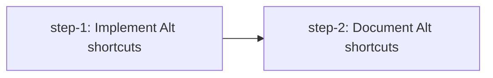

# Implementation Plan

Design: .agents/planning/zellij-alt-shortcuts/design/detailed-design.md
Created: 2026-06-19
Tasks: 2

## Dependency Graph

## Acknowledged Tradeoffs

Inherited from design (see design doc "Acknowledged Tradeoffs" section for full details):
- Direct Alt bindings are terminal-mode-only (diverges from Zellij's cross-mode "shared" bindings)
- Direct Alt bindings unconditionally and silently shadow focused pane apps in terminal mode
- `split_auto`, `move_tab_*`, `resize_grow/shrink` are Alt-only (no prefix companion)
- `Alt+x` / `Alt+z` are herdr extras not in Zellij defaults
- No protocol/wire/integration version bump needed (confirmed: no persistent state change)

## Rejected Feedback

- "Split step 1 into 2-3 sub-steps" — REJECTED. The skill's anti-pattern forbids splitting cohesive work when there is no shippable intermediate state between sub-steps. Config fields without dispatch arms don't compile (non-exhaustive match). The design itself characterizes this as "LOW-effort, config-and-dispatch change." One implementation step is correct.
- "Specify insertion ordering for `action_for_key` additions" — REJECTED. Prescribes HOW to implement; implementation decisions belong to `/develop`.
- "Enumerate specific test names from design" — REJECTED. The plan defines WHAT to deliver (acceptance criteria), not HOW (specific test names). The design doc is the authoritative implementation reference.
- "Run `just check` at sub-step level" — REJECTED. There's one implementation step; `just check` passes is the criterion. Incremental runs are an implementation practice, not a plan criterion.

## Tasks

### step-1: Implement Alt shortcuts with config, dispatch, helpers, and tests

- **Acceptance criteria:**
  - [x] `Alt+h/j/k/l` focus the pane left/down/up/right in terminal mode (existing `focus_pane_*` actions gain Alt variant via `BindingConfig::Many`)
  - [x] `Alt+n` splits the focused pane along its longer dimension (new `SplitAuto` action with `auto_split_direction` helper)
  - [x] `Alt+x` closes the focused pane, `Alt+z` toggles zoom (existing actions gain Alt variant)
  - [x] `Alt+=` grows and `Alt+-` shrinks the focused pane by 5%, falling back across axes (new `ResizeGrow`/`ResizeShrink` actions with `resize_focused_pane` helper)
  - [x] On a stacked (all-vertical-splits) layout, `Alt+=` still changes the split ratio (does not silently no-op) — axis-fallback works
  - [x] `AppState::resize_pane` returns `bool` indicating whether ratios changed; existing callers in modal.rs and snapshot.rs compile without changes (return value unused); `mark_session_dirty()` gated on change being non-zero
  - [x] `Alt+i` / `Alt+o` move the active tab left/right (new `MoveTabLeft`/`MoveTabRight` actions with `move_active_tab_left/right` helpers handling insert-before semantics)
  - [x] All existing `prefix+*` bindings for these actions continue to work unchanged
  - [x] Single-string user configs still parse (`BindingConfig::One`); absent new fields deserialize as unbound
  - [x] Default config produces zero conflict diagnostics (N4 invariant test)
  - [x] TOML round-trip is lossless for Many-valued bindings
  - [x] Keybind help screen renders the new Alt bindings alongside prefix bindings
  - [x] `resize_mode` (`prefix+r`) is unchanged
  - [x] `just check` passes (formatting, tests, maintenance scripts)
- **Dependencies:** none (can start immediately)
- **Affected areas:** `src/config/model.rs`, `src/config/keybinds.rs`, `src/app/input/navigate.rs`, `src/app/input/mod.rs`, `src/app/actions.rs`, `src/app/state.rs`, `src/ui/keybind_help.rs`, `src/layout.rs`

### step-2: Document Alt shortcuts in unreleased docs

- **Acceptance criteria:**
  - [x] Unreleased docs at `docs/next/website/src/content/docs/` include a page or section covering the default Alt shortcut table
  - [x] Known limitations documented: unconditional silent interception, terminal-mode-only scope, outer multiplexer consumption
  - [x] `Alt+x` destructive behavior called out specifically
  - [x] Config shape change documented (dual-bound actions export as TOML arrays; single-string still parses)
  - [x] Diagnosing "my Alt key does nothing" guidance included
  - [x] `docs/next/CHANGELOG.md` updated with the feature entry
- **Dependencies:** step-1 (docs must reflect actual implementation)
- **Affected areas:** `docs/next/website/src/content/docs/`, `docs/next/CHANGELOG.md`
